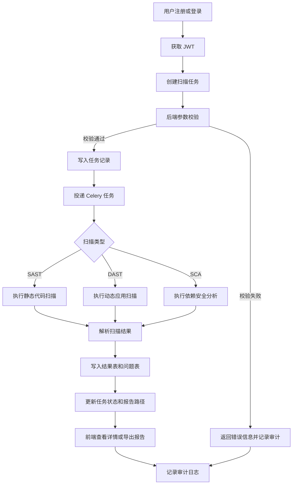
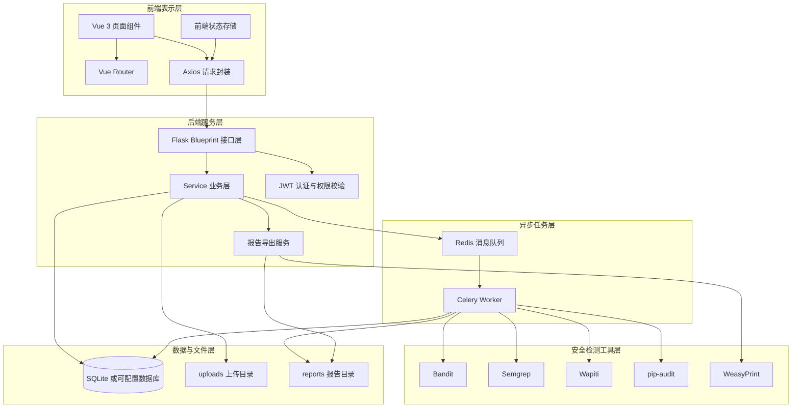
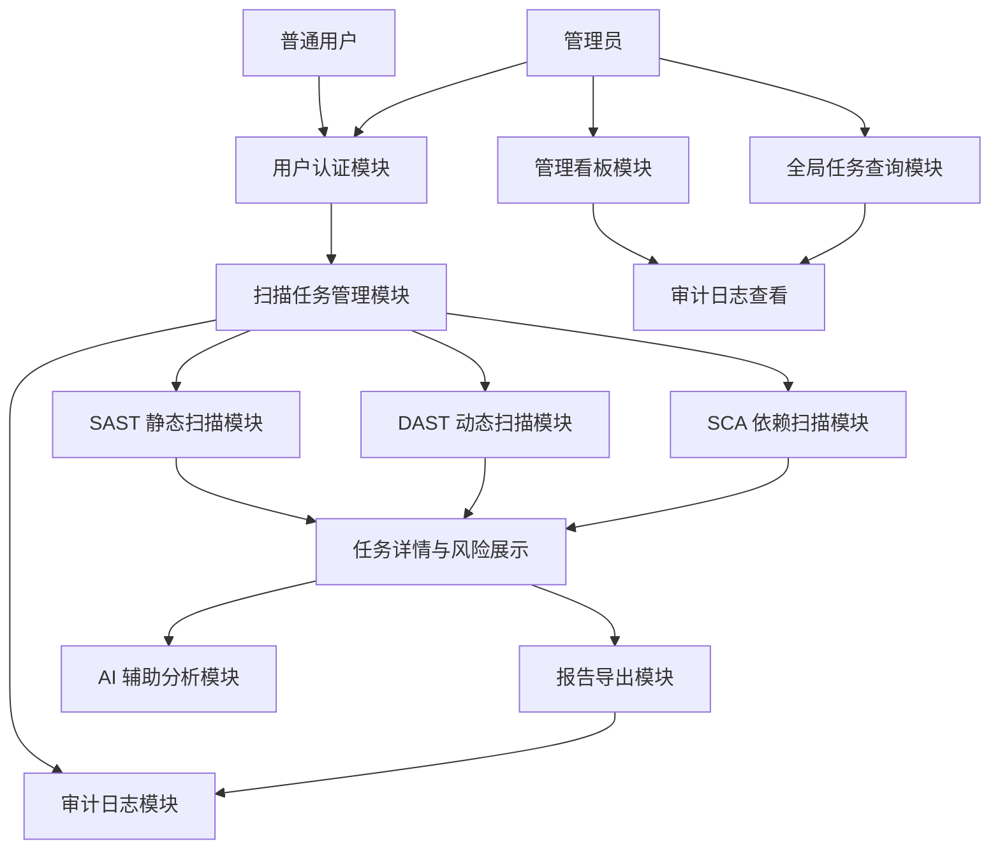
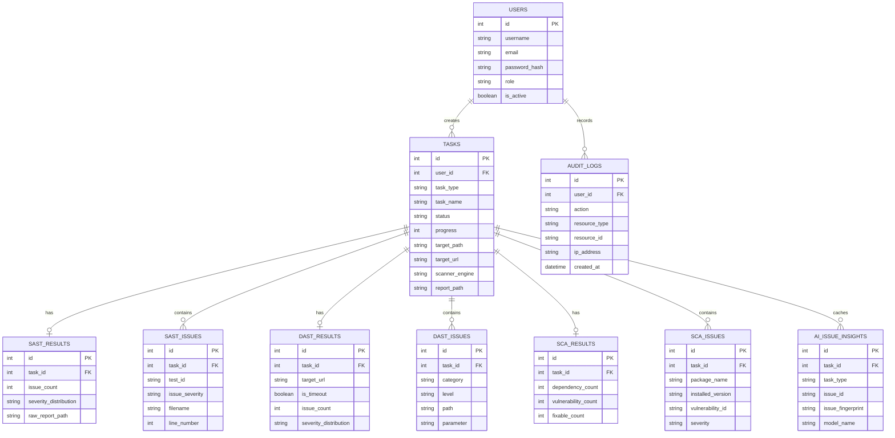
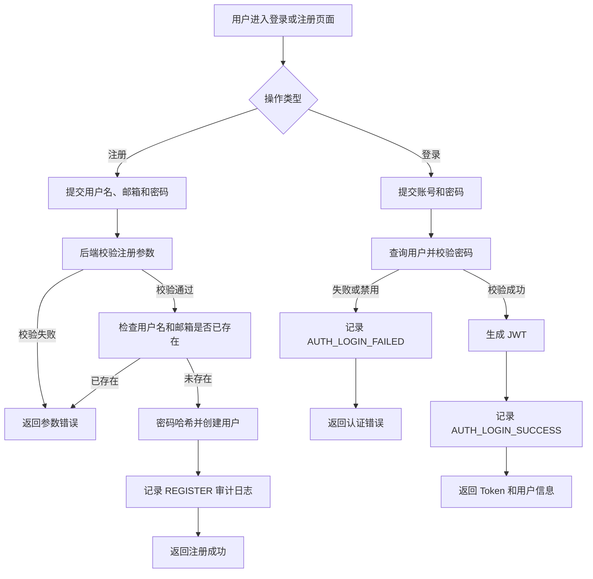
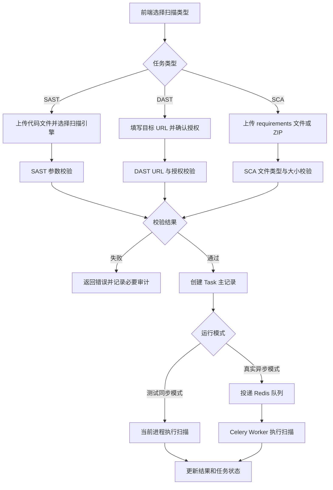
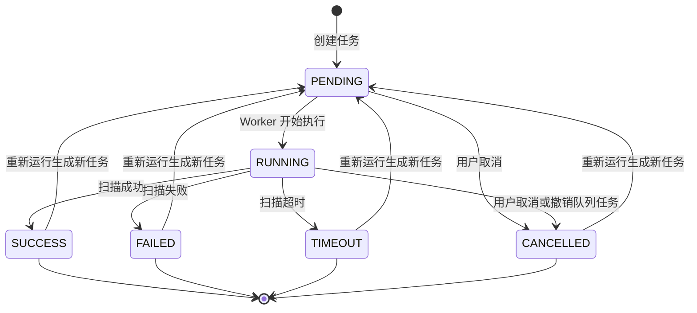
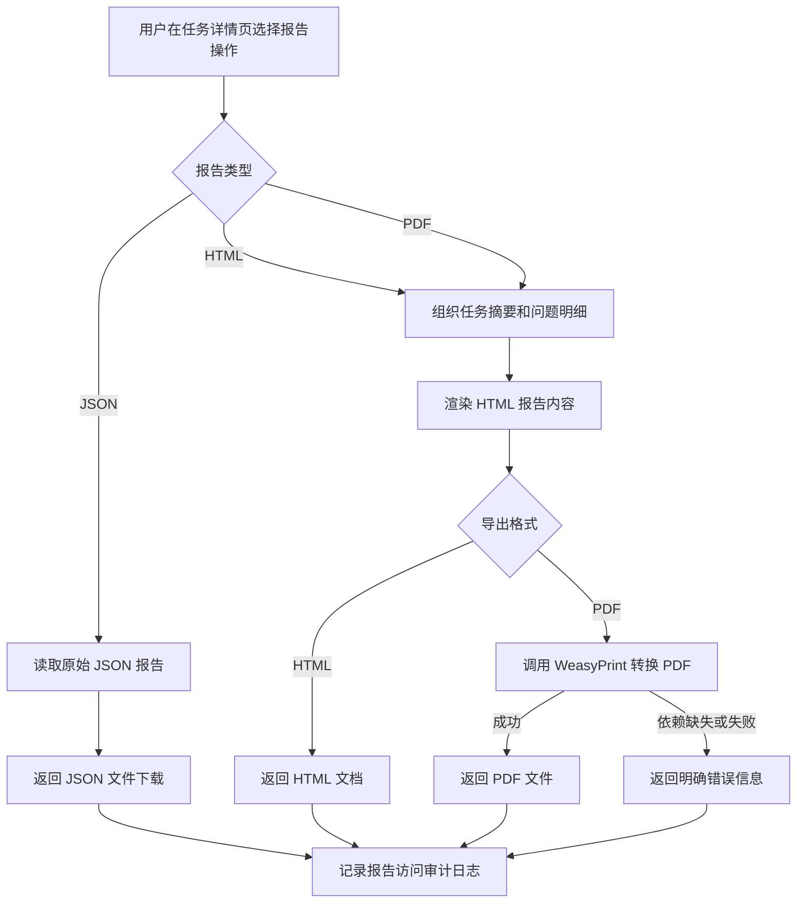
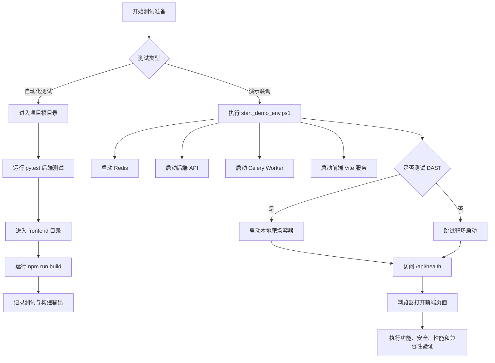
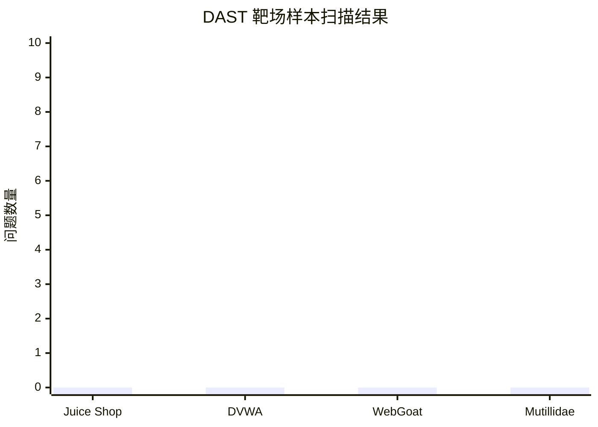

# 基于 Flask 和 Vue 的 DevSecOps 安全审计平台设计与实现

## 摘要

随着软件系统迭代速度加快，传统依赖上线前集中安全测试和人工审计的方式逐渐难以满足持续交付场景下的安全管理需求。针对安全检测介入较晚、扫描结果分散、整改追踪困难和操作过程缺少审计等问题，本文设计并实现了一个基于 Flask 和 Vue 的 DevSecOps 安全审计平台。系统采用前后端分离架构，后端基于 Flask、JWT、SQLAlchemy、Celery 和 Redis 实现接口服务、用户认证、数据持久化和异步扫描任务，前端基于 Vue 3、Vite、TypeScript 和 Axios 实现扫描创建、任务列表、任务详情、管理看板和审计日志等页面。平台围绕 SAST、DAST 和 SCA 三类安全检测任务展开，支持静态代码分析、动态应用扫描、依赖风险识别、任务状态跟踪、漏洞结果展示、HTML/PDF 报告导出和操作审计记录。系统测试从功能、安全、性能和兼容性等方面进行验证，结果表明系统能够完成安全扫描任务创建、异步执行、风险展示、报告归档和审计追溯等核心流程，基本满足毕业设计中对轻量化 DevSecOps 安全审计平台的设计目标。

**关键词：** DevSecOps；安全审计；静态代码分析；动态应用扫描；软件成分分析；Flask；Vue

## Abstract

With the increasing speed of software iteration, traditional security testing that mainly depends on final-stage manual review is no longer sufficient for continuous delivery scenarios. To address problems such as late security detection, scattered scan results, difficult remediation tracking, and insufficient operation auditing, this thesis designs and implements a DevSecOps security audit platform based on Flask and Vue. The system adopts a front-end and back-end separation architecture. The back end uses Flask, JWT, SQLAlchemy, Celery, and Redis to provide API services, user authentication, data persistence, and asynchronous scan task execution. The front end uses Vue 3, Vite, TypeScript, and Axios to implement scan creation, task list, task details, administrator dashboard, and audit log pages. The platform focuses on three types of security detection tasks, including SAST, DAST, and SCA. It supports static code analysis, dynamic application scanning, dependency risk identification, task status tracking, vulnerability result display, HTML/PDF report export, and operation audit logging. Functional, security, performance, and compatibility tests show that the system can complete the main workflow of scan task creation, asynchronous execution, risk display, report archiving, and audit tracing, which basically meets the design goal of a lightweight DevSecOps security audit platform for this graduation project.

**Key words:** DevSecOps; Security Audit; Static Code Analysis; Dynamic Application Scanning; Software Composition Analysis; Flask; Vue

## 1 绪论

### 1.1 研究背景

随着互联网应用、企业信息系统和软件服务平台的快速发展，软件系统承载的数据规模、业务复杂度和开放接口数量不断增加。软件研发模式也从传统的阶段式开发逐步转向敏捷开发、持续集成和持续交付。在这种背景下，软件版本迭代频率明显提高，功能上线周期缩短，安全问题如果仍主要依赖上线前集中测试或人工审计，容易出现发现时间滞后、整改成本较高、复测过程繁琐和安全责任难以追溯等问题。

近年来，DevSecOps 理念逐渐受到关注。DevSecOps 强调将安全活动融入软件开发和运维流程，使安全检测不再是独立于研发流程之外的后置环节，而是在编码、构建、测试、部署和运行过程中持续进行。对于中小型项目、课程设计项目和毕业设计项目而言，虽然不一定具备大型企业完整的安全运营体系，但仍然需要一种轻量化平台，将代码安全检查、动态漏洞扫描、依赖风险识别、任务状态跟踪和审计记录等能力整合起来，从而形成较完整的安全检测闭环。

本课题围绕“基于 Flask 和 Vue 的 DevSecOps 安全审计平台设计与实现”展开，结合当前项目实际功能，构建一个面向安全扫描任务管理的 Web 平台。系统通过前后端分离架构提供用户认证、扫描任务创建、SAST 静态代码分析、DAST 动态应用扫描、SCA 依赖安全分析、任务详情展示、报告导出、管理看板和操作审计日志等功能。平台的目标不是替代专业商业安全产品，而是在毕业设计范围内实现一个结构清晰、功能闭环、可部署验证的安全审计系统。

#### 1.1.1 软件安全管理痛点与研究意义

在实际软件开发过程中，安全管理常见痛点主要体现在以下几个方面。首先，安全检测介入时间较晚。许多项目在功能开发完成后才集中进行安全测试，一旦发现代码缺陷、依赖漏洞或运行时漏洞，往往需要回到开发阶段重新定位和修改，影响交付效率。其次，人工审计效率有限。人工代码审计虽然可以发现复杂逻辑问题，但对于大量文件、重复性规则检查和依赖版本核查而言，完全依赖人工容易造成效率低、覆盖不稳定和结果难以复现的问题。

再次，扫描结果容易分散。SAST、DAST 和 SCA 工具通常各自生成不同格式的结果文件或终端输出，如果缺少统一平台进行任务管理和结果沉淀，用户需要在多个工具之间切换，不利于后续风险统计、报告整理和整改追踪。最后，安全操作过程缺少审计。扫描任务由谁创建、何时创建、目标是什么、是否确认授权、是否导出报告等信息，如果没有记录，后续难以进行责任追溯和问题复盘。

本课题的研究意义在于，通过设计并实现一个轻量化 DevSecOps 安全审计平台，将安全检测过程从单次工具调用提升为可管理的任务流程。系统将 SAST、DAST 和 SCA 三类安全检测能力统一纳入任务模型，通过异步任务机制执行扫描，通过数据库保存任务状态和结果明细，通过前端页面展示风险信息，并通过报告导出和审计日志形成结果归档与操作追踪。该设计有助于提高安全检测流程的规范性和可视化程度，也为中小项目在开发测试阶段引入自动化安全检测提供参考。

#### 1.1.2 DevSecOps 安全审计平台的应用价值

DevSecOps 安全审计平台的应用价值主要体现在流程整合、风险可视化和结果可追溯三个方面。在流程整合方面，平台将用户登录、任务创建、扫描执行、结果查看和报告导出组织在统一 Web 工作台中，使安全检测不再是零散命令执行，而是可以被用户持续跟踪的任务流。对于开发人员和安全测试人员来说，统一入口可以降低工具使用门槛，提高检测过程的一致性。

在风险可视化方面，平台将不同扫描工具输出的原始结果转换为统一的任务摘要和问题明细。SAST 结果可以展示代码文件、规则编号、行号和风险等级；DAST 结果可以展示目标 URL、漏洞类型、请求证据和风险等级；SCA 结果可以展示依赖包、版本、漏洞编号和修复建议。通过结构化展示，用户能够更快理解扫描结论，并根据风险等级安排整改优先级。

在结果可追溯方面，平台通过数据库保存历史任务、扫描结果和审计日志。任务状态包括 `PENDING`、`RUNNING`、`SUCCESS`、`FAILED`、`TIMEOUT` 和 `CANCELLED` 等，能够反映扫描生命周期；审计日志记录登录、任务创建、任务取消、任务重跑、报告导出和 DAST 授权等关键行为，能够支持后续复盘。与单独运行工具相比，平台化实现更有利于形成“检测、记录、分析、归档”的闭环。

### 1.2 国内外研究现状

#### 1.2.1 国外研究现状

国外在软件安全工程、DevSecOps 和自动化安全检测方面起步较早，已经形成了较多标准、模型和工具实践。NIST 发布的 Secure Software Development Framework（SSDF）强调在软件开发生命周期中纳入安全开发实践，目标是减少已发布软件中的漏洞，并降低未修复漏洞被利用造成的影响[1]。OWASP SAMM 则提供软件保障成熟度模型，帮助组织评估和改进安全开发生命周期中的治理、设计、实现、验证和运营等活动[2]。这些研究和框架表明，软件安全不应只依赖最终测试，而应成为贯穿开发流程的持续活动。

在应用安全风险识别方面，OWASP Top 10 长期作为 Web 应用安全风险认知和测试的重要参考，覆盖访问控制、加密失败、注入、设计缺陷、安全配置错误和组件风险等常见方向[3]。在工程实践中，国外大量安全工具围绕 SAST、DAST、IAST、SCA 和容器安全等方向发展。SAST 工具用于在源码或构建阶段发现潜在缺陷，DAST 工具用于对运行中的 Web 应用进行外部扫描，SCA 工具用于识别第三方依赖组件及其公开漏洞。商业平台和开源工具链通常进一步与 Git、CI/CD、制品仓库和缺陷管理系统集成，使安全检测结果能够进入研发流程。

在供应链安全方面，SLSA 等框架提出通过分级要求增强软件制品来源、构建过程和依赖链路的可信度[4]。这类研究反映出软件安全关注点已经从单个应用漏洞扩展到依赖组件、构建过程和制品完整性。对于本课题而言，虽然系统没有实现完整的软件供应链治理能力，但通过 SCA 功能识别 Python 依赖风险，已经体现了对第三方组件安全的关注。

总体来看，国外研究和实践呈现出标准化、自动化和平台化趋势。成熟平台往往功能完善，能够覆盖代码仓库扫描、流水线集成、漏洞管理、风险度量和合规报告等环节。但这类平台通常部署和配置成本较高，对于教学、毕业设计和中小型项目来说，仍然需要更轻量、易理解和便于二次开发的实现方案。

#### 1.2.2 国内研究现状

国内在软件安全、代码审计和漏洞扫描方面也开展了大量研究与实践。高校和科研机构通常从静态分析规则、漏洞检测算法、Web 漏洞扫描、依赖风险识别和安全管理平台等方向进行探索，重点关注如何提高检测覆盖率、降低误报率和提升漏洞定位效率。企业实践则更多围绕安全开发生命周期、DevSecOps 平台建设、持续集成安全检测、制品安全和合规审计展开。

在静态代码分析方面，国内研究常关注源代码语法结构、数据流分析、污点传播和危险函数识别等问题，用于发现注入、命令执行、路径遍历、敏感信息泄露等潜在风险。在动态扫描方面，研究重点通常包括爬虫覆盖率、参数发现、漏洞验证、扫描效率和授权边界控制。在依赖安全方面，随着开源组件广泛使用，依赖版本、漏洞库匹配和修复建议逐渐成为软件安全治理的重要内容。

在平台建设方面，国内许多实践已经从单一工具使用转向安全能力整合。常见平台通常包括用户管理、项目管理、扫描任务管理、漏洞结果展示、风险统计、报告生成和审计追踪等功能。对于大型企业而言，这些平台还会进一步与代码仓库、流水线、缺陷管理系统和安全运营系统打通。对于中小团队和教学场景而言，更关注平台是否易于部署、是否能覆盖主要安全检测流程、是否能够清晰展示任务状态和扫描结果。

结合本课题任务要求和项目实现，本系统选择以 Flask、Vue、Celery 和 Redis 构建轻量化平台，重点实现安全扫描任务管理、SAST/DAST/SCA 检测、风险展示、报告导出和审计日志，而不追求大型商业平台的全量能力。这种取向符合毕业设计对系统完整性、可实现性和可验证性的要求。

#### 1.2.3 研究述评

综合国内外研究现状可以看出，软件安全检测已经从单点工具使用逐渐发展为流程化、自动化和平台化的安全治理能力。DevSecOps、SSDF、SAMM 等理念和模型强调安全活动应尽早介入开发生命周期，并通过持续检测和反馈降低漏洞修复成本。SAST、DAST 和 SCA 等技术分别从源码、运行时应用和第三方依赖三个角度发现安全风险，能够形成互补。

但是，现有工具和平台在实际落地时仍存在一些问题。首先，不同工具输出格式差异较大，结果分散，缺少统一管理会增加使用成本。其次，大型平台功能复杂，部署和维护成本较高，不一定适合课程设计、中小项目或本地演示环境。再次，单纯的扫描工具往往只关注漏洞发现，而对任务状态、报告归档、授权确认和操作审计支持不足。

因此，本课题选择实现一个轻量化 DevSecOps 安全审计平台，重点解决“工具调用零散、任务状态不清、结果难以沉淀、操作缺少追溯”的问题。系统将 SAST、DAST 和 SCA 纳入统一任务管理流程，通过异步执行机制提升接口响应体验，通过前端工作台展示风险结果，通过 HTML/PDF 报告导出和审计日志支持结果归档与过程追踪。该系统不以高并发生产平台为目标，而是以毕业设计和中小型安全检测场景为对象，验证 DevSecOps 安全检测流程的平台化实现方法。

### 1.3 研究内容与论文结构

#### 1.3.1 研究内容

本课题的研究内容围绕 DevSecOps 安全审计平台的设计与实现展开，主要包括以下几个方面。

第一，研究并设计平台总体架构。系统采用前后端分离模式，前端使用 Vue 3、Vite、TypeScript 和 Axios 构建交互页面，后端使用 Flask 提供 RESTful API，使用 SQLAlchemy 进行数据持久化，使用 JWT 实现用户认证，使用 Celery 和 Redis 支撑异步扫描任务。通过分层设计，将接口层、服务层、模型层、异步任务层和前端视图层分离，提高系统可维护性。

第二，设计并实现用户认证与权限控制。系统提供用户注册、登录、当前用户查询和 Token 校验等功能。普通用户可以创建和查看自己的扫描任务，管理员可以访问管理看板和全局统计数据。系统通过前端路由守卫和后端 JWT 校验共同限制访问，并通过用户角色区分普通用户和管理员。

第三，设计并实现扫描任务管理。系统将 SAST、DAST 和 SCA 抽象为统一任务，任务状态包括 `PENDING`、`RUNNING`、`SUCCESS`、`FAILED`、`TIMEOUT` 和 `CANCELLED`。用户可以创建扫描任务、查看任务列表和任务详情，并在符合条件时取消或重新运行任务。任务信息、目标信息、扫描引擎、执行时间、错误信息和报告路径均持久化保存。

第四，设计并实现多类型安全检测能力。SAST 模块面向源代码文件或压缩包进行静态安全分析，支持 Bandit 和 Semgrep 等扫描引擎配置；DAST 模块面向授权 Web 目标进行动态扫描，使用 Wapiti 执行检测，并对目标 URL、授权确认和允许范围进行校验；SCA 模块面向 Python 依赖文件进行组件风险识别，通过 pip-audit 检测依赖漏洞。三类检测结果均会被整理为任务摘要和问题明细。

第五，设计并实现结果展示、报告导出和管理审计功能。前端提供任务列表、任务详情、风险明细、管理看板和审计日志页面。后端支持 JSON、HTML 和 PDF 等形式的报告导出，并记录登录、任务创建、任务取消、重跑、报告导出和 DAST 授权等关键操作。管理看板用于展示全局任务和风险统计，审计日志用于支撑操作追溯。

第六，对系统进行功能、安全、性能和兼容性测试。测试内容包括用户认证、任务创建、SAST/DAST/SCA 扫描、报告导出、管理看板、审计日志、JWT 权限控制、文件上传限制、DAST 授权校验、有限并发任务创建和浏览器兼容性等。通过自动化测试和人工联调验证系统主要功能链路的可用性。

#### 1.3.2 论文结构

本文共分为七章，各章内容安排如下。

第 1 章为绪论。该章介绍课题研究背景、软件安全管理痛点、DevSecOps 安全审计平台的应用价值，归纳国内外研究现状，并说明本文研究内容与论文结构。

第 2 章为相关技术基础。该章介绍系统所采用的前后端分离架构、RESTful 接口、Flask、JWT、SQLAlchemy、Vue 3、Vite、Axios、Celery、Redis，以及 SAST、DAST 和 SCA 等安全检测技术，为后续系统设计与实现提供技术基础。

第 3 章为系统需求分析。该章从可行性、用户角色、功能需求和非功能需求等方面分析系统建设目标，明确普通用户和管理员的使用场景，并提出用户认证、扫描任务、结果展示、报告导出、管理看板和审计日志等功能需求。

第 4 章为系统总体设计。该章说明系统运行流程、分层架构、功能模块划分、数据库设计和安全设计，重点描述前端页面、后端接口、异步任务、数据库模型和安全扫描工具之间的协作关系。

第 5 章为系统详细设计与实现。该章结合项目代码说明登录认证、扫描任务管理、SAST 静态扫描、DAST 动态扫描、SCA 依赖安全分析、报告导出、管理看板和操作审计日志等模块的具体实现过程。

第 6 章为系统测试。该章从测试环境、功能测试、安全测试、性能与兼容性测试等方面验证系统功能，说明自动化测试、页面验证、有限并发测试和真实异步联调的结果，并对测试结论和改进方向进行分析。

第 7 章为总结与展望。该章总结本文完成的主要工作，分析系统实现效果和不足，并从扫描能力扩展、前端自动化测试、依赖生态扩展、性能优化和持续集成接入等方面提出后续改进方向。

## 2 相关技术基础

本系统面向 DevSecOps 场景下的安全审计与漏洞扫描需求，采用前后端分离架构，将用户交互、任务管理、安全扫描、结果展示和审计记录拆分为相对独立的模块。前端负责扫描任务创建、任务列表、任务详情、管理看板和审计日志等页面展示，后端负责用户认证、接口校验、任务持久化、异步扫描调度、检测结果解析和报告导出。由于 SAST、DAST 和 SCA 任务通常具有耗时长、结果结构差异大、执行环境依赖明显等特点，系统在技术选型上需要同时考虑 Web 接口响应、异步任务执行、数据持久化和安全边界控制。

本章围绕项目实际采用的关键技术进行说明，包括前后端分离架构、RESTful 接口、Flask 后端框架、JWT 认证、SQLAlchemy 数据访问、Vue 3 前端框架、Vite 构建工具、Axios 请求封装、Celery 与 Redis 异步任务机制，以及 SAST、DAST、SCA 三类安全检测技术。这些技术共同支撑后续章节中的系统需求分析、总体设计、详细实现和系统测试。

### 2.1 前后端分离架构

前后端分离架构是指前端页面和后端服务分别开发、构建与运行，两者通过 HTTP 接口进行数据交互。相比传统服务端模板渲染方式，前后端分离更适合本系统的任务型工作台场景。用户在浏览器中完成登录、注册、新建扫描、查看任务和导出报告等操作，后端只需提供结构化接口和业务处理能力，不直接参与页面渲染。这样可以降低界面展示逻辑与扫描业务逻辑之间的耦合，也便于在后续扩展移动端、命令行客户端或持续集成调用入口时复用后端能力。

在本系统中，前端项目位于 `frontend` 目录，后端项目位于 `backend` 目录。前端通过 Vue 3 构建单页应用，使用 Vue Router 定义 `/login`、`/register`、`/scan/new`、`/tasks`、`/tasks/:id`、`/admin` 和 `/audit-logs` 等页面路由。后端通过 Flask Blueprint 将接口划分为认证、任务、SAST、DAST、SCA、管理、指标、AI 辅助、健康检查和审计日志等模块，接口统一挂载在 `/api` 路径下。前端页面不直接访问数据库或扫描工具，而是通过 Axios 调用后端 API，由后端完成权限校验、任务创建和结果读取。

这种架构与 DevSecOps 平台的功能特点较为匹配。一方面，扫描任务的创建和查看需要较强的交互性，前端可以根据任务类型动态展示 SAST、DAST 或 SCA 表单；另一方面，扫描执行、报告导出和审计记录涉及服务器文件、异步队列和数据库写入，适合由后端集中处理。前后端分离后，系统可以在保持接口稳定的前提下分别改进页面体验和后端扫描能力。

#### 2.1.1 RESTful 接口与统一响应

RESTful 接口设计强调以资源为中心组织 URL，并使用 HTTP 方法表达操作语义。在本系统中，任务、认证信息、审计日志、管理看板和指标统计都可以被视为资源。后端接口按照模块划分为 `/api/auth`、`/api/tasks`、`/api/sast`、`/api/dast`、`/api/sca`、`/api/admin`、`/api/metrics`、`/api/audit-logs` 等路径，前端根据资源路径完成数据读取和操作提交。例如，用户登录和当前用户查询属于认证资源，任务列表和任务详情属于任务资源，SAST/DAST/SCA 新建扫描则属于不同扫描类型的任务入口。

统一响应格式是前后端协作的重要基础。由于系统接口数量较多，如果不同接口返回结构差异过大，前端需要为每个接口编写大量特殊处理逻辑，不利于维护。当前项目在后端工具层封装了成功响应和错误响应，业务异常通过统一的 `ApiError` 处理，404 和未捕获异常也会转化为统一格式的错误结果。前端 Axios 封装可以基于统一结构处理 Token、错误提示和业务数据，从而降低页面与接口之间的适配成本。

对安全扫描平台而言，统一响应还具有审计和排错价值。扫描任务可能因为参数错误、文件类型不支持、扫描引擎不存在、DAST 目标未授权、队列执行失败或报告依赖缺失等原因失败。后端通过统一错误码、错误信息和 HTTP 状态码返回问题原因，前端可以将错误展示给用户，测试章节也可以据此验证系统在异常输入下的行为是否符合预期。

#### 2.1.2 前后端协同方式

本系统的前后端协同主要围绕用户身份、任务状态和结果展示展开。用户登录成功后，后端签发 JWT，前端保存认证状态并在后续请求中携带 Token。路由守卫会检查用户是否已登录，未登录用户访问工作台、任务详情、管理看板或审计日志等页面时会被引导到登录页面。这样可以在前端层面减少无效访问，同时后端接口仍然负责最终权限校验。

扫描任务的协同方式体现为“前端提交配置、后端创建任务、异步执行扫描、前端查询状态”。用户在新建扫描页面选择 SAST、SCA 或 DAST 类型后，前端将文件、URL、扫描引擎和授权确认等参数提交给后端。后端完成参数校验和任务记录写入后，将耗时扫描交由 Celery Worker 执行。任务执行过程中，数据库中的任务状态会从 `PENDING`、`RUNNING` 逐步更新为 `SUCCESS`、`FAILED`、`TIMEOUT` 或 `CANCELLED`。前端任务列表和任务详情页通过查询接口展示最新状态、进度、错误信息和扫描结果。

在结果展示方面，前后端协同需要处理不同扫描类型的数据差异。SAST 结果强调文件路径、规则、行号和风险等级；DAST 结果强调目标 URL、请求证据、漏洞类型和风险等级；SCA 结果强调依赖包名称、版本、漏洞编号和修复建议。后端负责将扫描工具输出解析为统一的数据库模型和 JSON 结构，前端根据任务类型选择相应的展示区域。该协同方式避免了前端直接理解底层扫描工具原始输出，也便于后续扩展新的扫描引擎。

### 2.2 Flask、JWT 与 SQLAlchemy

后端是本系统业务逻辑和安全控制的核心，主要承担接口路由、参数校验、权限控制、数据库操作、异步任务投递、扫描结果解析和报告导出等职责。当前项目选择 Flask 作为 Web 框架，结合 Flask-JWT-Extended 实现认证，使用 Flask-SQLAlchemy 和 SQLAlchemy 管理数据库访问。该组合相对轻量，适合毕业设计中以清晰模块划分实现完整业务闭环。

Flask 的优势在于框架本身简洁，能够根据项目规模灵活组织目录结构。本系统不是单一接口脚本，而是包含认证、任务、扫描、审计、管理和指标等多个模块，因此在 Flask 基础上进一步采用 Blueprint、Service、Model 和 Worker 的分层方式。JWT 用于解决前后端分离场景下的用户身份传递问题，SQLAlchemy 用于将用户、任务、漏洞结果和审计日志等数据结构映射到关系型数据库。

#### 2.2.1 Flask 后端分层设计

本系统后端按照职责分为 API 层、服务层、模型层、工具层和异步任务层。API 层位于 `backend/app/api`，负责定义接口路径、接收请求参数并返回响应。项目中已经注册了 `/api/auth`、`/api/tasks`、`/api/sast`、`/api/dast`、`/api/sca`、`/api/audit-logs`、`/api/admin`、`/api/metrics`、`/api/ai` 和 `/api/health` 等蓝图。通过这种方式，不同业务模块的接口可以独立维护，避免所有路由堆叠在单个文件中。

服务层位于 `backend/app/services`，用于承载具体业务逻辑。例如，认证服务处理用户注册、密码校验和登录；任务服务处理任务创建、查询、取消、重跑和报告读取；SAST、DAST、SCA 服务分别处理不同扫描类型的参数校验、工具调用或结果解析；审计服务记录关键操作；报告导出服务负责将任务结果整理为 HTML 或 PDF。服务层的存在可以减少 API 层代码复杂度，使接口函数更关注请求与响应，而把可复用的业务规则集中在服务模块中。

模型层位于 `backend/app/models`，用于定义数据库表结构和对象关系。任务模型中包含任务类型、任务状态、目标路径、目标 URL、扫描引擎、报告路径、执行耗时和错误信息等字段，并通过关系关联 SAST、DAST 和 SCA 的结果与问题明细。任务类型被限制为 `SAST`、`DAST` 和 `SCA`，任务状态被限制为 `PENDING`、`RUNNING`、`SUCCESS`、`FAILED`、`TIMEOUT` 和 `CANCELLED`，这些枚举值也直接服务于前端页面展示和系统测试。

工具层主要提供统一响应、异常处理、配置读取和通用校验能力。后端在蓝图注册时统一处理 `ApiError`、404 和未捕获异常，使异常输出保持一致。异步任务层位于 `backend/app/workers`，通过 Celery 将 SAST、DAST 和 SCA 扫描任务从 Web 请求中拆分出去，避免用户提交扫描后长时间等待接口返回。

#### 2.2.2 JWT 认证与数据库访问

在前后端分离系统中，后端通常不依赖传统服务端 Session 维护页面状态，而是通过 Token 在请求之间传递用户身份。当前项目使用 Flask-JWT-Extended 生成和校验 JWT。用户登录成功后，后端根据账号密码校验结果签发访问令牌，前端在后续请求中携带该令牌。后端受保护接口通过 JWT 获取当前用户身份，并据此限制任务列表、任务详情、审计日志和管理接口的访问范围。

JWT 认证在本系统中的作用不只是判断是否登录，还与数据隔离和角色权限相关。普通用户只能查看和操作自己的任务，管理员可以访问管理看板和全局统计信息。项目中的用户角色枚举项为 `UserRole.USER` 和 `UserRole.ADMIN`，接口返回值为 `user` 和 `admin`，因此论文中对权限设计的描述需要与这两个实际角色保持一致。对安全审计平台而言，任务结果中可能包含代码路径、漏洞细节、依赖信息和目标地址，必须避免普通用户越权访问他人任务。

数据库访问方面，项目使用 Flask-SQLAlchemy 集成 SQLAlchemy ORM。ORM 将 Python 类映射为数据库表，使业务代码可以通过模型对象操作用户、任务、扫描结果和审计日志，而不需要在每个业务函数中手写 SQL。配置文件中默认数据库地址为 SQLite 文件，测试环境使用内存 SQLite；同时系统保留 `DATABASE_URL` 配置项，便于后续切换到其他关系型数据库。论文撰写时应以当前代码事实为准，不能将系统固定描述为仅使用 MySQL。

SQLAlchemy 在系统中的价值体现在关系建模和状态更新上。一个任务会关联一个用户，并根据任务类型关联 SAST、DAST 或 SCA 的结果表和问题明细表。扫描执行过程中，Worker 会更新任务状态、进度、开始时间、结束时间、耗时、错误信息和结果摘要。前端查询任务详情时，后端再将这些持久化数据转换为 JSON 返回。通过数据库持久化，系统可以保留历史扫描记录，为报告导出、审计回溯和管理统计提供基础。

### 2.3 Vue 3、Vite 与 Axios

前端部分承担系统的主要交互界面，是用户接触平台功能的入口。当前项目使用 Vue 3 构建页面，使用 Vite 进行开发和构建，使用 TypeScript 提高代码可维护性，并通过 Axios 与后端接口通信。前端页面包括登录、注册、新建扫描、任务列表、任务详情、管理看板和审计日志等，围绕“创建扫描任务、跟踪任务状态、查看检测结果、导出报告和追溯操作记录”这一主流程组织。

Vue 3 适合构建这种中小型管理型单页应用。页面可以拆分为视图组件和局部交互组件，不同页面共享认证状态、请求封装和样式体系。Vite 提供快速的本地开发服务器和前端构建流程，项目中的 `npm run build` 会先进行 TypeScript 检查，再完成生产构建。Axios 则为前端调用后端 API 提供统一入口，便于处理基础地址、请求头、Token 和错误响应。

#### 2.3.1 前端组件化开发

组件化开发的核心思想是将页面拆分为可维护的功能单元。当前项目的主要页面组件位于 `frontend/src/views`，包括 `LoginView.vue`、`RegisterView.vue`、`ScanCreateView.vue`、`TaskListView.vue`、`TaskDetailView.vue`、`AdminDashboardView.vue` 和 `AuditLogView.vue`。这些视图组件分别对应用户认证、扫描创建、任务管理、结果查看、管理员统计和审计日志查询等功能。

在本系统中，组件化的价值首先体现在任务类型切换上。新建扫描页面需要支持 SAST、SCA 和 DAST 三类任务，不同任务的输入项并不相同。SAST 和 SCA 侧重文件上传，DAST 侧重目标 URL、扫描授权和扫描范围。前端通过组件状态控制表单展示和提交参数，使用户可以在统一入口中完成不同类型扫描创建。其次，任务详情页需要根据任务类型展示不同结果结构，组件化能够减少页面条件逻辑混乱，使风险摘要、问题列表和报告操作保持清晰。

项目还使用 Tailwind CSS 作为样式工具，配合 Vue 组件组织页面布局和状态展示。由于本系统属于安全审计和任务管理类平台，前端设计更强调信息密度、状态可读性和操作路径清晰，而不是营销型展示。任务状态、风险等级、扫描类型、时间信息和错误信息都需要在页面中明确呈现，以便用户判断扫描是否完成以及是否需要进一步处理。

#### 2.3.2 路由、请求与页面状态管理

Vue Router 用于管理单页应用内部页面跳转。当前项目定义了登录、注册、新建扫描、任务列表、任务详情、管理看板和审计日志等路由，并在路由守卫中检查认证状态。除登录和注册页面外，其他页面都需要用户已登录后才能访问。该设计与后端 JWT 校验共同构成前后端双层访问控制：前端负责减少未登录用户进入业务页面的机会，后端负责对每个接口进行实际权限判断。

请求层位于 `frontend/src/api`，包括认证、任务、管理和审计等接口封装。前端视图组件不直接拼接复杂请求逻辑，而是调用 API 模块中的函数完成数据交互。这样可以使接口路径、请求参数和错误处理集中维护。当后端接口调整时，只需优先修改 API 封装层，而不必在多个页面中重复修改。

页面状态管理主要围绕认证状态、任务筛选条件、任务详情数据和加载错误状态展开。认证状态用于判断用户是否登录和是否需要跳转；任务列表页面需要保存当前页码、任务类型、任务状态等筛选条件；任务详情页面需要根据任务 ID 拉取任务基本信息、扫描结果和报告导出入口；管理看板和审计日志页面则需要处理统计数据、筛选条件和表格展示。对扫描平台而言，状态管理还需要考虑异步任务的不确定性，即任务可能在用户查看页面时仍处于运行中，因此页面应能够展示 `PENDING`、`RUNNING`、`SUCCESS`、`FAILED`、`TIMEOUT` 和 `CANCELLED` 等不同状态。

### 2.4 Celery、Redis 与异步任务

安全扫描任务通常无法在一次普通 HTTP 请求中快速完成。SAST 需要读取和分析源代码文件，SCA 需要解析依赖并查询漏洞信息，DAST 需要对目标 Web 应用发起请求并整理响应证据。如果将这些过程直接放在接口请求中同步执行，用户需要长时间等待，浏览器和服务器也更容易出现超时。因此，本系统采用 Celery 和 Redis 构建异步任务机制，将扫描执行过程从 Web 请求中解耦出来。

Celery 是 Python 生态中常用的分布式任务队列框架，适合处理耗时任务、后台任务和定时任务。Redis 在本系统中作为 Celery 的消息代理和结果后端，用于传递任务消息和保存任务执行状态。后端 API 在创建任务后，将具体扫描任务投递给 Celery Worker；Worker 独立执行扫描逻辑，并将结果写回数据库。前端则通过任务查询接口获取任务当前状态。

#### 2.4.1 扫描任务异步执行机制

本系统的异步任务机制可以概括为“接口创建任务记录，队列执行扫描，数据库保存结果”。用户提交 SAST、DAST 或 SCA 扫描请求后，后端首先进行身份校验、参数校验和文件或目标地址校验。校验通过后，系统在数据库中创建任务记录，初始状态一般为 `PENDING`。随后，后端将任务 ID 等必要信息投递给对应 Celery 任务，例如 SAST Worker、DAST Worker 或 SCA Worker。

Celery Worker 接收到任务后，会根据任务类型调用对应服务逻辑。SAST Worker 调用静态代码分析工具并解析结果；DAST Worker 调用动态扫描工具并处理目标授权、扫描范围和漏洞证据；SCA Worker 调用依赖风险检测工具并整理依赖漏洞。扫描过程中，Worker 可以将任务状态更新为 `RUNNING`，并在成功完成后更新为 `SUCCESS`；如果出现工具执行异常、超时或用户取消，则更新为 `FAILED`、`TIMEOUT` 或 `CANCELLED`。

该机制使 Web 接口能够快速返回任务创建结果，用户无需等待扫描过程完成。前端可以在任务列表中查看任务状态，也可以进入任务详情页查看进度、错误信息和扫描结果。对毕业设计系统而言，这种异步设计能够体现 DevSecOps 工具链中“任务提交与后台执行分离”的基本思想，也为后续接入更多扫描工具提供扩展空间。

#### 2.4.2 任务状态跟踪与结果回写

任务状态跟踪是异步扫描系统可用性的关键。如果只有后台执行而没有状态记录，用户无法判断任务是否已经完成，也无法定位失败原因。当前项目在任务模型中定义了任务类型、任务状态、进度、扫描引擎、目标路径、目标 URL、报告路径、结果摘要、错误信息、队列任务 ID、开始时间、结束时间和耗时等字段。这些字段共同描述了一个扫描任务从创建到完成的生命周期。

结果回写主要包括三类数据。第一类是任务级数据，如状态、进度、耗时、报告路径和错误信息；第二类是扫描摘要数据，如问题总数、风险等级分布、依赖数量或目标页面数量；第三类是问题明细数据，如 SAST 的文件位置和规则编号、DAST 的漏洞 URL 和证据、SCA 的依赖包名称和漏洞编号。Worker 在扫描完成后将这些数据写入数据库，前端再通过任务详情接口读取并展示。

为了便于测试和本地开发，系统配置中还提供了 `CELERY_TASK_ALWAYS_EAGER` 选项。测试环境下该选项为真，任务可以在当前进程内同步执行，便于 pytest 验证接口和服务逻辑；开发或演示环境中可使用 Redis 和 Celery Worker 运行真实异步流程。论文中描述异步机制时应区分测试模式和真实异步模式，避免将测试环境的同步执行误写为生产运行方式。

### 2.5 SAST、DAST 与 SCA 安全检测技术

DevSecOps 强调将安全能力嵌入开发、测试和交付流程，而不是在系统上线前才进行一次性安全检查。在本系统中，安全检测能力主要体现为三类任务：SAST、DAST 和 SCA。SAST 关注源代码中的潜在缺陷，DAST 关注运行中 Web 应用的外部可见漏洞，SCA 关注第三方依赖包中的已知风险。三类检测从不同角度覆盖应用安全问题，形成较完整的安全审计流程。

当前项目将 SAST、DAST 和 SCA 统一抽象为任务。用户在前端选择任务类型并提交目标后，后端创建任务记录并通过异步队列执行扫描。扫描完成后，系统将结果整理为统一的任务摘要和问题明细，供任务详情页、报告导出、管理看板和审计日志使用。由于不同扫描工具输出格式不同，系统并不直接把原始输出展示给用户，而是通过服务层解析和转换，使结果能够被前端稳定消费。

#### 2.5.1 静态代码分析与依赖风险识别

SAST 即静态应用安全测试，主要在不运行程序的情况下分析源代码或代码包，发现潜在的安全缺陷、危险函数调用、不安全配置和编码问题。本系统的 SAST 功能面向用户上传的代码文件或压缩包，配置中默认支持 Bandit，并保留 Semgrep 作为可选扫描引擎。Bandit 更偏向 Python 代码安全检查，Semgrep 可以通过规则集进行模式匹配式分析。系统通过扫描引擎配置控制允许使用的工具，避免用户提交任意命令。

在本系统中，SAST 的作用是为用户提供代码层面的风险识别能力。用户上传代码并创建 SAST 任务后，后台扫描服务会调用指定引擎分析代码，将发现的问题转换为风险等级、规则编号、文件路径、行号和描述等结构化数据。任务详情页可以据此展示问题列表，报告导出功能也可以将结果整理为可阅读的审计材料。由于静态分析可能存在误报，论文中应将其表述为“辅助发现潜在风险”，不应夸大为完全准确的漏洞判定。

SCA 即软件成分分析，主要用于识别第三方依赖组件及其已知漏洞。现代 Web 应用往往依赖大量开源包，如果依赖版本存在公开漏洞，即使业务代码本身没有明显缺陷，也可能引入安全风险。本系统的 SCA 功能主要面向 Python `requirements.txt` 及包含该文件的 ZIP 包，配置中使用 `pip-audit` 作为扫描命令。系统会解析依赖文件，识别存在风险的包、版本、漏洞编号和修复建议等信息。

SAST 和 SCA 的共同点是都可以在应用部署前执行，适合接入开发和测试阶段。二者的关注点不同：SAST 关注项目自身代码，SCA 关注第三方依赖。将二者同时纳入平台，可以使系统不仅检查代码实现问题，也关注依赖供应链风险。这与任务书和开题报告中“自动化代码审计与漏洞扫描”的目标一致，同时也符合当前项目已经实现的功能边界。

#### 2.5.2 动态应用扫描与漏洞结果整理

DAST 即动态应用安全测试，主要在目标 Web 应用运行时，从外部访问应用并检测潜在漏洞。与 SAST 不同，DAST 不直接分析源代码，而是通过 HTTP 请求、页面爬取和攻击载荷测试观察应用响应，从而发现可能存在的跨站脚本、注入、敏感信息泄露或错误配置等问题。本系统配置中使用 Wapiti 作为 DAST 扫描工具，适合在授权测试环境或本地靶场中进行动态扫描。

由于 DAST 会对目标站点发起请求，本系统在设计上强调扫描授权和目标范围控制。用户创建 DAST 任务时需要填写目标 URL 并确认授权，后端会校验 URL 格式、目标主机和允许访问范围。配置中默认允许本地地址和私有网络，默认不允许扫描公网目标。该设计可以降低误扫未授权目标的风险，也符合安全测试中的基本合规要求。论文中描述 DAST 功能时，应明确其面向授权目标和实验靶场，不应表述为任意公网扫描平台。

DAST 结果整理是动态扫描功能落地的重要环节。扫描工具原始输出通常包含大量请求、响应、插件信息和漏洞细节，如果直接展示给用户，阅读成本较高。系统需要从原始结果中提取漏洞名称、风险等级、目标 URL、请求证据、描述和修复建议等字段，并与任务记录关联保存。前端任务详情页再根据这些结构化数据展示风险摘要和问题列表，报告导出功能则将其整理为 HTML 或 PDF 材料。

综合来看，SAST、DAST 和 SCA 分别从代码、运行时应用和依赖供应链三个角度支持安全审计。三者并非互相替代关系，而是互相补充：SAST 适合较早发现代码缺陷，SCA 适合识别依赖漏洞，DAST 适合验证运行环境中的外部可见问题。本系统将三类检测统一纳入任务管理、异步执行、结果展示和审计记录流程，为后续系统总体设计和详细实现奠定技术基础。

## 3 系统需求分析

系统需求分析的目的是明确平台需要解决的问题、面向的用户对象、功能范围和非功能约束。根据任务书和开题报告，本课题面向 DevSecOps 场景，重点解决传统人工审查效率低、扫描结果分散、任务执行耗时、操作过程缺少追踪以及安全检测难以覆盖开发和上线前多个阶段等问题。结合当前系统实现，平台需要支持用户认证、任务管理、SAST 静态代码扫描、DAST 动态应用扫描、SCA 依赖安全分析、风险详情展示、报告导出、管理看板和审计日志等能力。

### 3.1 可行性分析

#### 3.1.1 技术可行性

本系统采用前后端分离架构，后端使用 Flask 提供 RESTful API，前端使用 Vue 3、Vite、TypeScript 和 Axios 构建交互界面。该技术路线与任务书中“Flask + SQLAlchemy 建模用户、任务、审计日志”和“Vite + Vue3 + TS + Tailwind 组件化实现前端”的要求一致。Flask 具有轻量、灵活和易于模块化组织的特点，适合将用户认证、任务管理、扫描接口、审计日志和管理看板拆分为独立 Blueprint。SQLAlchemy 能够将用户、任务、扫描结果和审计日志抽象为模型对象，便于实现关系映射和查询封装。

安全扫描任务通常耗时较长，如果直接在 Web 请求中同步执行，会导致接口响应变慢甚至阻塞。因此系统使用 Celery 作为异步任务框架，并通过 Redis 作为消息队列和结果后端，将 SAST、DAST、SCA 扫描任务放入 Worker 中执行。任务书和开题报告均提出需要使用 Celery/Redis 解决任务调度、排队、取消、重跑和稳定性问题，当前项目也通过 `sast_tasks.py`、`dast_tasks.py` 和 `sca_tasks.py` 实现了三类扫描任务的异步执行。

在安全检测能力方面，系统使用 Bandit 和 Semgrep 支持 Python 代码静态审计，使用 Wapiti 支持 Web 应用动态扫描，使用 pip-audit 支持 Python 依赖漏洞分析。这些工具均能够输出结构化结果，便于后端解析后写入数据库并展示到前端页面。报告导出方面，系统支持 JSON、HTML 和 PDF 三类形式，其中 PDF 由 WeasyPrint 根据 HTML 报告生成。综上，当前技术栈能够满足本系统的主要功能需求，具有技术可行性。

表 3-1 为系统技术可行性分析。

表 3-1 系统技术可行性分析

| 技术方向 | 采用技术 | 可行性说明 |
|---|---|---|
| 后端接口 | Flask、Blueprint | 能够按认证、任务、扫描、审计和管理模块组织接口 |
| 数据访问 | SQLAlchemy、Flask-Migrate | 能够完成用户、任务、结果、问题和审计日志建模 |
| 身份认证 | Flask-JWT-Extended | 能够支持前后端分离场景下的 Token 鉴权 |
| 异步任务 | Celery、Redis | 能够处理耗时扫描任务，支持队列化和任务状态跟踪 |
| 静态扫描 | Bandit、Semgrep | 能够对 Python 代码进行规则化安全检查 |
| 动态扫描 | Wapiti | 能够对授权 Web 目标进行动态安全检测 |
| 依赖扫描 | pip-audit | 能够对 Python 依赖清单进行漏洞识别 |
| 前端实现 | Vue 3、Vite、Axios、Tailwind CSS | 能够实现组件化页面、路由控制和接口交互 |
| 报告导出 | JSON、HTML、WeasyPrint PDF | 能够支持结果归档和论文展示需要 |

#### 3.1.2 经济与操作可行性

从经济可行性看，本系统主要基于开源框架和开源安全工具构建，不依赖商业扫描平台或收费云服务。Flask、Vue、Celery、Redis、Bandit、Wapiti 和 pip-audit 均可在本地开发环境部署和运行，适合毕业设计场景下的开发、测试和演示。系统使用通用开发设备即可完成核心功能验证，除必要的运行环境配置外，不需要额外硬件投入，因此具有较好的经济可行性。

从操作可行性看，系统将 SAST、DAST 和 SCA 三类检测统一到扫描创建页面，用户只需要选择扫描类型并提交必要参数即可创建任务。任务创建后，用户可以在工作台查看任务状态、结果摘要和报告详情，避免直接操作命令行扫描工具。对于管理员，系统提供管理看板和全平台任务列表，能够查看全局任务状态、风险概况、运行状态和近期异常任务。审计日志页面支持按动作类型、结果、资源编号和时间范围筛选，便于追溯关键操作。

同时，系统在操作层面设置了必要的安全边界。SAST 和 SCA 对上传文件类型和大小进行限制，DAST 要求用户确认目标授权并校验目标范围，登录、任务创建等接口配置限流策略。这些设计既降低了误操作风险，也使平台更适合在教学、实验和小型团队安全检测场景中使用。

### 3.2 用户角色分析

#### 3.2.1 用户角色划分

从使用场景看，系统主要面向普通用户或开发人员、安全测试人员和管理员三类对象。其中普通用户或开发人员关注个人代码和依赖风险，希望能够快速提交扫描任务并查看结果；安全测试人员关注扫描结果的解释、证据和整改建议，希望能够对代码、依赖和 Web 目标进行复核；管理员关注全局任务、风险分布、运行状态和审计日志，希望能够从平台层面掌握安全检测情况。

从代码实现看，系统当前实际角色枚举项为 `UserRole.USER` 和 `UserRole.ADMIN`，接口返回值为 `user` 和 `admin`。普通用户和安全测试人员在系统权限上均属于普通用户范围，能够创建和查看自己的任务；管理员拥有更高权限，可以查看管理看板和全平台任务信息。论文中可以按使用场景描述三类用户，但在权限设计和实现说明中应以这两类代码角色为准。

表 3-2 为系统用户角色与职责划分。

表 3-2 用户角色与职责划分

| 使用角色 | 代码权限角色 | 主要职责 | 典型功能 |
|---|---|---|---|
| 普通用户/开发人员 | `UserRole.USER`（返回值 `user`） | 提交个人扫描任务，查看个人任务结果 | 注册登录、新建 SAST/SCA/DAST 任务、查看任务列表、查看报告、取消任务、重新运行任务 |
| 安全测试人员 | `UserRole.USER`（返回值 `user`） | 对代码、依赖或 Web 目标进行安全检测和结果分析 | 查看风险等级、问题明细、请求证据、代码位置、整改建议和导出报告 |
| 管理员 | `UserRole.ADMIN`（返回值 `admin`） | 查看全平台任务、风险统计和审计信息 | 管理看板、全局任务查询、任务筛选、审计日志查看、运行状态查看 |

#### 3.2.2 角色权限需求

系统权限需求主要体现在登录访问、任务访问、报告访问、管理接口访问和审计日志访问五个方面。未登录用户只能访问登录和注册页面，不能访问任务、扫描、审计和管理相关接口。普通用户登录后，可以创建 SAST、DAST 和 SCA 任务，可以查看、取消和重跑自己的任务，也可以下载和导出自己的任务报告。普通用户不能查看其他用户任务，也不能访问管理看板和全平台任务接口。

管理员在普通用户能力基础上，还可以访问 `/api/admin/dashboard` 和 `/api/admin/tasks`，查看全平台任务统计、风险摘要、近期失败任务、最近审计日志和所有用户扫描任务。管理员查看其他用户任务报告时，系统会记录相应的管理查看审计日志，用于后续追溯。

审计日志权限也需要区分角色。普通用户只能查看与自身相关的审计记录；管理员可以查看更完整的平台审计数据，并根据用户、动作、结果、资源编号和时间范围进行筛选。通过上述权限划分，系统能够在满足个人使用和管理员监管需求的同时，避免普通用户越权访问他人任务和报告。

### 3.3 功能需求分析

#### 3.3.1 核心业务需求

核心业务需求围绕安全扫描任务闭环展开。根据任务书和开题报告，系统需要完成用户鉴权、任务管理、SAST、DAST、报告展示和审计日志等功能；结合当前项目实际实现，系统进一步扩展了 SCA 依赖扫描、HTML/PDF 报告导出、管理看板和 AI 辅助解释。所有需求均应能够在第 4 章总体设计和第 5 章详细实现中找到对应模块。

表 3-3 为系统核心功能需求。

表 3-3 系统核心功能需求

| 功能模块 | 功能需求 | 对应实现 |
|---|---|---|
| 用户认证 | 支持用户注册、登录、Token 鉴权、当前用户信息查询 | `/api/auth/register`、`/api/auth/login`、`/api/auth/me`，前端登录注册页面和 Token 存储 |
| 任务管理 | 支持任务创建、列表查询、分页、状态查看、取消、重新运行 | `/api/tasks`、`/api/tasks/<id>/cancel`、`/api/tasks/<id>/rerun`，任务模型和工作台页面 |
| SAST 静态扫描 | 支持上传代码文件或压缩包，选择 Bandit 或 Semgrep 扫描，保存结果摘要和问题明细 | `/api/sast/tasks`、SAST Worker、`sast_results`、`sast_issues` |
| DAST 动态扫描 | 支持提交授权目标 URL，校验目标范围，调用 Wapiti 执行动态扫描 | `/api/dast/tasks`、DAST Worker、`dast_results`、`dast_issues` |
| SCA 依赖扫描 | 支持上传 `requirements.txt` 或包含该文件的 ZIP，调用 pip-audit 分析依赖漏洞 | `/api/sca/tasks`、SCA Worker、`sca_results`、`sca_issues` |
| 风险详情 | 支持按任务类型展示风险指标、问题明细、证据、代码位置、修复建议和分析摘要 | `TaskDetailView.vue`，三类详情接口 |
| 报告导出 | 支持 JSON 报告下载，支持 HTML 和 PDF 报告导出 | `/report` 和 `/export` 接口，`report_export_service.py` |
| 审计日志 | 记录注册、登录、任务创建、取消、重跑、报告访问、导出、DAST 授权等关键操作 | `audit_logs`、`audit_service.py`、`AuditLogView.vue` |
| 管理看板 | 支持管理员查看全局任务统计、风险摘要、运行状态和全平台任务列表 | `/api/admin/dashboard`、`/api/admin/tasks`、`AdminDashboardView.vue` |

在这些功能中，任务管理是平台的业务主线。SAST、DAST 和 SCA 都以任务形式进入系统，并通过统一状态字段反映执行进度和结果。报告展示和审计日志则分别解决“如何理解扫描结果”和“如何追溯平台操作”的问题，使系统形成从任务创建到结果归档的闭环。

#### 3.3.2 支撑功能需求

除核心扫描流程外，系统还需要若干支撑功能保障平台可用性和可维护性。首先，系统需要统一响应和错误处理机制，使前端能够根据后端返回的状态码和错误信息展示提示。项目中通过 `success_response`、`error_response` 和自定义 `ApiError` 实现接口响应封装，能够统一处理参数错误、认证失败、权限不足和资源不存在等情况。

其次，系统需要任务统计和指标展示功能。普通用户工作台需要查看个人任务总数、运行中任务、已完成任务和失败类任务；管理员看板需要查看全平台任务类型分布、状态分布、风险摘要和运行状态。这些能力由 `/api/metrics/task-summary` 和 `/api/admin/dashboard` 支撑。

再次，系统需要健康检查和运行环境验证能力。后端提供 `/api/health` 接口，管理看板中也会检查数据库、Redis、DAST 扫描器和 Celery 模式等运行状态，便于在演示和测试时发现环境问题。

最后，系统需要适当的辅助分析能力。当前项目提供 `/api/ai/issue-insight` 接口，可以针对单个问题生成含义、影响、修复和验证建议，并使用 `ai_issue_insights` 表缓存结果。该功能可以作为风险详情的辅助解释能力，但不应在论文中描述为自动修复或完整智能审计系统。

### 3.4 非功能需求分析

#### 3.4.1 安全性与可靠性需求

安全性是本系统的关键非功能需求。平台本身处理用户账号、上传文件、目标 URL、扫描报告和审计日志，如果缺少必要限制，可能产生新的安全风险。因此系统需要满足以下安全要求：第一，用户访问应通过 JWT 鉴权，未登录用户不能访问任务、扫描、报告、审计和管理接口；第二，管理员接口应进行角色校验，避免普通用户访问全局任务和管理看板；第三，用户任务访问应进行数据隔离，普通用户只能查看和操作自己的任务；第四，上传文件应限制类型、大小和保存路径，压缩包处理应防止路径穿越；第五，DAST 扫描必须要求目标授权确认，并根据配置限制目标范围；第六，登录失败、任务创建、报告导出、DAST 授权等关键行为应记录审计日志。

可靠性方面，系统需要保证耗时扫描任务不会阻塞 Web 接口。通过 Celery 和 Redis，扫描任务可以异步执行，前端通过任务状态轮询或刷新查看进度。任务执行失败、超时或取消时，系统应保存明确状态和错误信息，便于用户判断是否需要重新运行。任务状态应保持可追踪，至少包括 `PENDING`、`RUNNING`、`SUCCESS`、`FAILED`、`TIMEOUT` 和 `CANCELLED` 六类状态。

表 3-4 为系统安全性与可靠性需求。

表 3-4 安全性与可靠性需求

| 需求类型 | 具体要求 | 项目对应机制 |
|---|---|---|
| 身份认证 | 登录后才能访问受保护资源 | JWT、路由守卫、`jwt_required()` |
| 权限控制 | 普通用户与管理员权限区分 | `UserRole.USER`、`UserRole.ADMIN`、`require_roles` |
| 数据隔离 | 普通用户只能访问自己的任务和审计记录 | `get_user_task`、`scoped_audit_query` |
| 文件安全 | 限制上传扩展名、大小和压缩包路径 | `validate_upload`、SCA ZIP 路径检查 |
| 目标授权 | DAST 仅扫描授权目标 | `authorization_confirmed`、目标主机策略校验 |
| 任务可靠性 | 扫描任务异步执行，状态可追踪 | Celery、Redis、`TaskStatus` |
| 异常处理 | 失败、超时、取消应有明确状态和错误信息 | `FAILED`、`TIMEOUT`、`CANCELLED`、`error_message` |
| 操作追溯 | 关键行为需要审计记录 | `audit_logs`、`log_action` |

#### 3.4.2 可维护性与易用性需求

可维护性方面，系统需要保持清晰的模块边界。后端按 `api`、`services`、`models`、`workers` 和 `utils` 分层组织，接口层负责请求入口和权限控制，服务层负责业务逻辑，模型层负责数据结构，任务层负责扫描执行，工具层负责通用功能。前端按 `views`、`api`、`router`、`store` 和 `components` 组织，页面组件负责交互展示，接口模块负责与后端通信，状态模块负责 Token 维护。这样的结构有利于后续扩展更多扫描引擎、报告格式或统计指标。

易用性方面，系统需要降低安全扫描工具的使用门槛。用户不需要直接掌握 Bandit、Semgrep、Wapiti 或 pip-audit 的命令行参数，而是通过统一的新建扫描页面提交文件或 URL。任务列表集中展示任务状态和结果摘要，任务详情页按扫描类型展示风险分布、问题明细、证据线索和整改建议，报告导出功能支持用户归档或提交结果。管理员页面提供全局扫描记录和筛选能力，便于从平台视角定位用户、任务、目标和状态。

可扩展性方面，系统应保留新增扫描能力的空间。当前任务表已经使用 `task_type` 区分扫描类型，结果表采用“任务主表 + 类型结果表 + 类型问题表”的设计。后续如果接入更多 SAST 规则集、DAST 工具、依赖漏洞库或通知方式，可以沿用现有任务调度和报告展示思路进行扩展。同时，系统对外提供 RESTful 接口，前后端职责清晰，也便于后续接入 CI/CD 流程或其他平台。

综合来看，本系统的需求不是单一漏洞扫描工具的简单封装，而是围绕 DevSecOps 场景，将身份认证、任务调度、安全检测、结果展示、报告归档和审计追踪组织为统一平台。上述需求均能在当前项目代码和第 4、5 章设计实现中找到对应依据。

## 4 系统总体设计

本章在需求目标和项目实际功能的基础上，对 DevSecOps 安全审计平台的整体结构、功能模块、数据库模型和安全机制进行设计说明。系统采用前后端分离架构，前端负责页面展示、交互控制和接口调用，后端负责身份认证、任务创建、扫描调度、结果解析、数据持久化和审计记录。对于 SAST、DAST、SCA 等耗时安全检测任务，系统通过 Celery 将扫描过程放入异步任务中执行，并使用 Redis 作为消息队列和任务结果后端，从而避免扫描过程阻塞 Web 请求。

### 4.1 系统架构设计

#### 4.1.1 系统运行流程

本系统的核心业务流程围绕安全扫描任务展开。用户首先通过注册和登录接口获得访问令牌，前端在后续请求中携带 JWT 访问受保护接口。用户进入工作台后，可以在统一的新建扫描页面选择扫描类型，并根据不同任务类型提交代码文件、依赖文件或目标 URL。后端接收到请求后，对参数、文件类型、文件大小、目标授权和任务创建频率进行校验，校验通过后写入任务主表，并将具体扫描过程投递给对应的 Celery Worker。

SAST 任务主要面向源代码或代码压缩包。系统保存用户上传文件后，根据任务配置调用 Bandit 或 Semgrep 执行静态扫描，并将扫描结果解析为风险摘要和问题明细。DAST 任务主要面向运行中的 Web 应用目标，系统要求用户确认目标授权，同时根据配置检查目标主机范围，随后调用 Wapiti 执行动态扫描。SCA 任务主要面向 Python 依赖文件，系统从上传的 `requirements.txt` 或压缩包中定位依赖清单，并调用 pip-audit 分析第三方组件漏洞。

扫描任务执行期间，任务状态由 `PENDING` 进入 `RUNNING`，扫描结束后根据执行结果更新为 `SUCCESS`、`FAILED`、`TIMEOUT` 或 `CANCELLED`。扫描结果被写入对应结果表和问题表，报告文件保存在后端报告目录中。前端通过任务列表和任务详情接口查询任务状态、风险分布和问题明细，并支持下载 JSON 报告或导出 HTML、PDF 报告。关键操作同时写入审计日志，用于后续追溯。

图 4-1 系统运行流程图



#### 4.1.2 分层架构设计

系统后端按照接口层、业务层、任务层、数据层和工具层进行组织，前端按照路由、页面、接口调用和状态存储进行组织。该结构能够降低页面交互、业务规则和扫描工具之间的耦合度，使不同扫描能力可以独立扩展。

系统分层结构如表 4-1 所示。

表 4-1 系统分层架构设计

| 层次 | 主要组成 | 作用 |
|---|---|---|
| 表示层 | Vue 3、Vue Router、Tailwind CSS、页面组件 | 提供登录注册、扫描创建、任务列表、任务详情、管理看板和审计日志等页面 |
| 接口层 | Flask Blueprint，包含 auth、tasks、sast、dast、sca、audit、admin、metrics、ai 等模块 | 对外提供 RESTful 接口，接收请求并返回统一响应 |
| 业务层 | auth_service、task_service、sast_service、dast_service、sca_service、audit_service、report_export_service | 处理认证、任务生命周期、扫描结果解析、报告导出和审计日志等业务逻辑 |
| 任务层 | Celery Worker，包含 sast_tasks、dast_tasks、sca_tasks | 异步执行耗时扫描任务，避免阻塞 Web 请求 |
| 数据层 | SQLAlchemy 模型、数据库、上传目录、报告目录 | 保存用户、任务、扫描结果、问题明细、审计日志和报告文件 |
| 工具层 | Bandit、Semgrep、Wapiti、pip-audit、WeasyPrint | 提供静态扫描、动态扫描、依赖漏洞分析和报告生成能力 |

在该架构中，前端不直接处理扫描工具和数据库操作，而是通过 Axios 调用后端接口。后端接口层负责鉴权、参数接收和响应封装，业务层负责具体规则处理，任务层负责调度耗时检测，数据层负责持久化。通过这种分层方式，系统可以在不改变前端页面主流程的情况下扩展新的扫描引擎或报告格式。

图 4-2 系统总体架构图



### 4.2 功能模块设计

#### 4.2.1 功能模块划分

根据当前项目实际代码，系统可划分为用户认证模块、扫描任务模块、SAST 静态扫描模块、DAST 动态扫描模块、SCA 依赖扫描模块、报告导出模块、管理看板模块、审计日志模块和 AI 辅助分析模块。其中用户认证、扫描任务、三类扫描、报告和审计日志构成系统核心业务闭环，管理看板用于提供全局统计视角，AI 辅助分析用于对单个风险项生成解释和修复建议。

表 4-2 为系统主要功能模块划分。

表 4-2 系统功能模块划分

| 模块 | 对应代码 | 主要功能 |
|---|---|---|
| 用户认证模块 | `backend/app/api/auth.py`、`auth_service.py`、`frontend/src/views/LoginView.vue`、`RegisterView.vue` | 用户注册、登录、JWT 生成、当前用户查询 |
| 扫描任务模块 | `backend/app/api/tasks.py`、`task_service.py`、`Task` 模型、`TaskListView.vue` | 任务列表、筛选分页、取消任务、重新运行任务 |
| SAST 模块 | `backend/app/api/sast.py`、`sast_service.py`、`sast_tasks.py`、`SastResult`、`SastIssue` | 上传代码文件，调用 Bandit 或 Semgrep，保存静态分析结果 |
| DAST 模块 | `backend/app/api/dast.py`、`dast_service.py`、`dast_tasks.py`、`DastResult`、`DastIssue` | 校验目标授权，调用 Wapiti，保存动态扫描结果 |
| SCA 模块 | `backend/app/api/sca.py`、`sca_service.py`、`sca_tasks.py`、`ScaResult`、`ScaIssue` | 分析 `requirements.txt`，调用 pip-audit，保存依赖漏洞结果 |
| 报告模块 | `report_export_service.py`、`backend/reports`、`TaskDetailView.vue` | 下载 JSON 报告，导出 HTML 和 PDF 报告 |
| 管理看板模块 | `backend/app/api/admin.py`、`AdminDashboardView.vue` | 统计全局任务、风险摘要、运行状态、最近审计日志和失败任务 |
| 审计日志模块 | `backend/app/api/audit.py`、`audit_service.py`、`AuditLog`、`AuditLogView.vue` | 记录和查询关键操作日志 |
| AI 辅助分析模块 | `backend/app/api/ai.py`、`ai_service.py`、`AiIssueInsight` | 对单个漏洞问题生成含义、影响、修复和验证建议 |

#### 4.2.2 模块协作关系

各功能模块并不是孤立存在，而是围绕任务对象进行协作。用户认证模块为所有受保护接口提供身份基础，任务模块负责保存任务主信息，三类扫描模块负责创建和执行具体检测，报告模块负责将结果组织成可下载文档，审计日志模块记录关键操作，管理看板模块则从任务、风险和审计数据中提取全局统计信息。

以创建 SAST 扫描任务为例，前端在 `ScanCreateView.vue` 中提交上传文件和任务参数，`frontend/src/api/task.ts` 调用 `/api/sast/tasks` 接口。后端 `sast.py` 对文件是否存在、文件扩展名、文件大小和扫描引擎进行校验，然后通过 `task_service.create_task` 创建任务记录。任务创建后，后端将任务投递给 `execute_sast_task`，由 Celery Worker 调用 `sast_service` 执行 Bandit 或 Semgrep 扫描。扫描完成后，系统将摘要写入 `sast_results`，将问题明细写入 `sast_issues`，并更新 `tasks` 表中的状态、进度、报告路径和结果摘要。

DAST 和 SCA 的协作方式与 SAST 类似，但参数校验和扫描工具不同。DAST 重点检查目标 URL、授权确认和目标主机策略；SCA 重点检查上传文件类型，并从 `.txt` 或 `.zip` 中定位 `requirements.txt`。这些差异由各自的 API 模块和 Service 模块处理，而任务状态、审计日志和报告导出则复用统一设计。

图 4-3 功能模块结构图



### 4.3 数据库设计

#### 4.3.1 关键数据表设计

系统数据模型围绕用户、任务、扫描结果、问题明细和审计日志展开。`users` 表保存用户身份信息，`tasks` 表保存扫描任务主信息，三类扫描分别使用结果表和问题表保存摘要与明细，`audit_logs` 表保存关键操作记录，`ai_issue_insights` 表保存 AI 辅助分析缓存。

表 4-3 为项目当前主要数据表设计。

表 4-3 主要数据表设计

| 数据表 | 主要字段 | 用途 |
|---|---|---|
| `users` | `id`、`username`、`email`、`password_hash`、`role`、`is_active`、`created_at`、`updated_at` | 保存用户账号、角色和状态 |
| `tasks` | `id`、`user_id`、`user_task_no`、`task_type`、`task_name`、`status`、`progress`、`target_path`、`target_url`、`authorization_confirmed`、`scanner_engine`、`report_path`、`queue_task_id` | 保存扫描任务主信息 |
| `sast_results` | `task_id`、`issue_count`、`high_count`、`medium_count`、`low_count`、`severity_distribution`、`confidence_distribution`、`file_distribution`、`raw_report_path` | 保存 SAST 扫描结果摘要 |
| `sast_issues` | `task_id`、`test_id`、`test_name`、`issue_severity`、`issue_confidence`、`filename`、`line_number`、`code`、`cwe`、`owasp` | 保存 SAST 问题明细 |
| `dast_results` | `task_id`、`target_url`、`is_timeout`、`issue_count`、`anomaly_count`、`additional_count`、`crawled_pages`、`scan_scope`、`severity_distribution` | 保存 DAST 扫描结果摘要 |
| `dast_issues` | `task_id`、`category`、`level`、`method`、`path`、`parameter`、`http_request`、`curl_command`、`wstg`、`cwe`、`owasp` | 保存 DAST 漏洞明细 |
| `sca_results` | `task_id`、`dependency_count`、`vulnerability_count`、`fixable_count`、`package_distribution`、`severity_distribution`、`raw_report_path` | 保存 SCA 扫描结果摘要 |
| `sca_issues` | `task_id`、`package_name`、`installed_version`、`vulnerability_id`、`aliases`、`fix_versions`、`description`、`severity` | 保存依赖漏洞明细 |
| `audit_logs` | `user_id`、`action`、`resource_type`、`resource_id`、`ip_address`、`user_agent`、`detail`、`created_at` | 保存操作审计记录 |
| `ai_issue_insights` | `task_id`、`task_type`、`issue_id`、`issue_fingerprint`、`model_name`、`meaning`、`impact`、`fix`、`verify` | 保存 AI 辅助分析结果 |

需要说明的是，项目代码默认数据库连接为 SQLite，本地开发时可直接运行；同时后端依赖中包含 PyMySQL，并可通过 `DATABASE_URL` 配置切换数据库。因此正式论文在描述数据库部署环境时，应以最终运行配置为准，避免将默认开发配置与部署配置混写。

#### 4.3.2 数据库实体关系

从实体关系上看，`User` 与 `Task` 是一对多关系，一个用户可以创建多个扫描任务。`Task` 是系统业务主实体，与 SAST、DAST、SCA 三类结果存在一对一关系，与三类问题明细存在一对多关系。`AuditLog` 与 `User` 之间为多对一关系，用于记录用户在系统中的关键操作。`AiIssueInsight` 与 `Task` 关联，并通过 `issue_id` 和 `issue_fingerprint` 定位具体问题项。

图 4-4 数据库 E-R 图



这种设计将任务主信息与扫描结果分离，使任务列表可以快速查询状态和摘要，而任务详情页可以根据任务类型加载对应结果和问题明细。对于后续扩展新的扫描类型，也可以继续沿用“任务主表 + 类型结果表 + 类型问题表”的方式，减少对现有任务管理流程的影响。

### 4.4 安全设计

#### 4.4.1 身份认证与访问授权

系统采用 JWT 进行身份认证。用户通过 `/api/auth/login` 登录成功后，后端生成访问令牌并返回给前端。前端在 `frontend/src/store/auth.ts` 中保存 Token，并在 `frontend/src/api/axios.ts` 的请求拦截器中将其放入 `Authorization: Bearer` 请求头。后端需要登录访问的接口使用 `jwt_required()` 进行保护，未登录用户无法访问任务、扫描、审计和管理相关接口。

在用户权限方面，系统当前定义了 `UserRole.USER` 和 `UserRole.ADMIN` 两类角色，接口对外返回的角色值为 `user` 和 `admin`。普通用户只能查看和操作自己的任务，管理员可以通过管理接口查看全局任务和看板信息。后端 `task_service.get_user_task` 会根据用户角色判断任务访问范围；管理员专用接口通过 `require_roles(UserRole.ADMIN)` 进行限制。该设计既保证普通用户的数据隔离，也为管理员提供全局安全运营视角。

此外，登录和注册接口配置了访问频率限制，能够在一定程度上降低重复提交和暴力尝试风险。用户密码在后端保存为哈希值，而不是明文存储，符合基本账号安全要求。

#### 4.4.2 扫描授权、文件与审计保护

安全扫描平台本身需要特别关注扫描目标授权和上传文件边界。对于 DAST 动态扫描，系统要求用户在创建任务时提交 `authorization_confirmed` 字段，明确确认目标已获授权。后端在 `validate_dast_payload` 中校验目标 URL 格式、授权确认状态、目标主机和 IP 策略。默认配置允许 localhost 和指定主机，是否允许私有网络或公网目标由配置项控制。若目标不符合策略，系统会拒绝创建扫描任务，并记录 DAST 授权拒绝日志。

对于文件上传，SAST 和 SCA 均限制上传文件类型和大小。SAST 默认允许 `.py`、`.zip`、`.tar.gz` 等文件类型，SCA 默认允许 `.txt` 和 `.zip`，上传大小由配置项控制。SCA 在处理压缩包时会检查压缩包成员路径，避免绝对路径和路径穿越内容。通过这些限制，系统能够降低任意文件上传和不安全解压带来的风险。

审计日志是系统安全设计的重要组成部分。系统会记录注册、登录成功、登录失败、任务创建、任务取消、任务重跑、报告查看、报告下载、报告导出、DAST 授权确认和授权拒绝等操作。审计记录中包含用户、操作类型、资源类型、资源 ID、IP 地址、User-Agent、详细信息和创建时间。普通用户只能查看与自身相关的审计日志，管理员可以查看更完整的审计信息。通过审计日志，系统能够在出现异常操作或扫描争议时提供追溯依据。

综合来看，本系统的安全设计主要体现在身份认证、角色授权、目标授权确认、上传限制、接口限流和操作审计等方面。这些机制与平台业务流程结合，能够支撑毕业设计场景下的安全扫描闭环和审计追踪要求。

## 5 系统详细设计与实现

本章在系统总体设计的基础上，结合项目实际代码说明各核心功能模块的实现过程。系统后端主要由 `backend/app/api`、`backend/app/services`、`backend/app/models` 和 `backend/app/workers` 组成，前端主要由 `frontend/src/views`、`frontend/src/api`、`frontend/src/router` 和 `frontend/src/store` 组成。各模块围绕扫描任务对象展开，通过 RESTful 接口、异步任务、数据库模型和前端页面协作完成安全审计流程。

### 5.1 登录认证与用户权限实现

#### 5.1.1 登录注册流程

登录认证功能对应后端 `backend/app/api/auth.py`、`backend/app/services/auth_service.py`、`backend/app/models/user.py`，前端对应 `frontend/src/views/LoginView.vue`、`frontend/src/views/RegisterView.vue`、`frontend/src/api/auth.ts` 和 `frontend/src/store/auth.ts`。

用户注册时，前端将用户名、邮箱和密码提交到 `/api/auth/register` 接口。后端首先通过 `validate_register_payload` 校验参数完整性、用户名长度、密码长度和邮箱格式，再调用 `register_user` 检查用户名和邮箱是否已存在。校验通过后，系统使用 `hash_password` 对密码进行哈希处理，并在 `users` 表中创建用户记录。用户默认角色为 `user`，账号状态由 `is_active` 字段控制。注册成功后，系统通过 `audit_service.log_action` 写入 `REGISTER` 审计日志，记录注册用户和操作结果。

用户登录时，前端调用 `/api/auth/login` 接口提交账号和密码。后端支持使用用户名或邮箱登录，通过 `login_user` 查询用户记录并校验密码哈希。如果账号不存在、密码错误或用户被禁用，接口返回明确的认证或权限错误，并记录 `AUTH_LOGIN_FAILED` 审计日志；如果校验成功，系统调用 `create_access_token` 生成 JWT，并返回访问令牌、令牌类型和用户信息，同时记录 `AUTH_LOGIN_SUCCESS` 审计日志。

通过上述流程，系统将账号注册、密码保护、登录认证和审计追踪结合起来，为后续任务创建、结果查看和管理操作提供身份基础。

图 5-1 登录注册流程图



#### 5.1.2 Token 校验与用户状态维护

前端登录成功后，`frontend/src/store/auth.ts` 将后端返回的访问令牌保存到 `localStorage`，并提供 `getAccessToken`、`saveToken`、`clearToken` 和 `isAuthenticated` 等方法维护登录状态。`frontend/src/api/axios.ts` 创建统一 Axios 实例，在请求拦截器中读取 Token，并自动设置 `Authorization: Bearer <token>` 请求头。若后端返回 401 状态码，响应拦截器会清除本地 Token，并跳转到登录页面。

路由层面，`frontend/src/router/index.ts` 通过 `router.beforeEach` 判断目标页面是否为公开页面。除 `/login` 和 `/register` 外，任务列表、扫描创建、任务详情、管理看板和审计日志等页面都要求用户已登录。未登录用户访问受保护页面时会被重定向到 `/login`。

后端通过 `@jwt_required()` 装饰器保护任务、扫描、审计、指标和管理接口，并通过 `current_user()` 获取当前用户对象。管理员相关接口还使用 `require_roles(UserRole.ADMIN)` 限制角色权限。普通用户只能访问自己的任务和审计数据，管理员可以访问全局任务和管理看板。该设计使前端路由控制和后端接口鉴权相互配合，避免仅依赖前端判断造成越权风险。

### 5.2 扫描任务管理实现

#### 5.2.1 任务创建与参数校验

扫描任务是系统业务主线，对应后端 `backend/app/models/task.py`、`backend/app/services/task_service.py` 以及 SAST、DAST、SCA 三类创建接口。前端统一入口为 `frontend/src/views/ScanCreateView.vue`，接口调用集中在 `frontend/src/api/task.ts`。

任务模型 `Task` 记录任务类型、任务名称、描述、状态、进度、目标路径、目标 URL、扫描引擎、报告路径、队列任务 ID、开始时间、结束时间和错误信息等字段。任务类型由 `TaskType` 枚举限定为 `SAST`、`DAST`、`SCA`，任务状态由 `TaskStatus` 枚举限定为 `PENDING`、`RUNNING`、`SUCCESS`、`FAILED`、`TIMEOUT`、`CANCELLED`。系统还通过 `user_task_no` 为每个用户维护独立的任务编号，便于用户在工作台中识别自己的扫描记录。

在前端新建扫描页面中，用户可以通过切换按钮选择 SAST、SCA 或 DAST。SAST 和 SCA 使用文件上传方式创建任务，DAST 使用目标 URL 和授权确认方式创建任务。不同任务类型提交到不同后端接口：SAST 调用 `/api/sast/tasks`，DAST 调用 `/api/dast/tasks`，SCA 调用 `/api/sca/tasks`。后端在创建任务前分别执行参数校验：SAST 校验上传文件和扫描引擎，DAST 校验 URL、授权确认、超时时间和目标范围，SCA 校验依赖文件类型和大小。

参数校验通过后，后端统一调用 `task_service.create_task` 写入任务记录。任务创建成功后，根据任务类型投递到对应 Celery 任务：`execute_sast_task`、`execute_dast_task` 或 `execute_sca_task`。如果配置为同步测试模式，任务会立即执行；否则任务会进入 Redis 队列等待 Worker 执行，并将 Celery 返回的队列任务 ID 写入 `queue_task_id` 字段。

图 5-2 扫描任务创建与投递流程图



#### 5.2.2 任务列表、取消与重新运行

任务列表功能对应 `backend/app/api/tasks.py` 中的 `/api/tasks` 接口和前端 `TaskListView.vue`。后端按照当前用户过滤任务，并支持按任务类型、任务状态、开始时间和结束时间筛选，同时通过分页参数控制返回数量。前端工作台页面调用 `listTasks` 和 `getTaskSummary` 获取任务列表与统计概览，展示任务编号、类型、扫描引擎、任务名称、状态、结果摘要、创建时间和操作入口。

任务取消功能由 `/api/tasks/<task_id>/cancel` 实现。后端首先通过 `get_user_task` 校验当前用户是否有权访问该任务，然后调用 `cancel_task` 判断任务状态。只有处于 `PENDING` 或 `RUNNING` 的任务允许取消。如果任务已经投递到 Celery 队列且处于运行状态，系统会尝试调用 `celery_app.control.revoke` 撤销任务。取消成功后，任务状态更新为 `CANCELLED`，进度更新为 100，并写入 `TASK_CANCEL` 审计日志。

任务重新运行功能由 `/api/tasks/<task_id>/rerun` 实现。后端通过 `clone_task` 复制原任务的任务类型、目标路径、目标 URL、超时时间、扫描引擎和授权信息，生成一个新的任务记录。随后系统根据新任务类型重新投递到对应 Celery Worker，并写入 `TASK_RERUN` 审计日志。前端 `TaskDetailView.vue` 在任务失败、超时、取消或需要复测时提供重新执行按钮，用户点击后会进入新任务详情页。

通过任务列表、取消和重新运行机制，系统能够支持扫描任务从创建、执行、异常处理到复测的完整生命周期。

图 5-3 扫描任务状态流转图



### 5.3 SAST 静态代码扫描实现

#### 5.3.1 代码上传与扫描触发

SAST 静态扫描功能对应后端 `backend/app/api/sast.py`、`backend/app/services/sast_service.py`、`backend/app/workers/sast_tasks.py`、`backend/app/models/sast_result.py` 和 `backend/app/models/sast_issue.py`，前端对应 `ScanCreateView.vue` 和 `TaskDetailView.vue`。

用户创建 SAST 任务时，需要在新建扫描页面上传代码文件或压缩包，并选择扫描引擎。当前后端配置默认支持 `bandit` 和 `semgrep` 两种扫描引擎，上传文件类型默认包括 `.py`、`.zip`、`.tar.gz`，上传大小由 `MAX_UPLOAD_SIZE_MB` 控制。后端接口 `/api/sast/tasks` 会读取上传文件、校验文件类型和大小、检查扫描引擎是否在允许列表中，然后通过 `save_upload` 将文件保存到上传目录。

文件保存完成后，后端创建 `SAST` 类型任务，并投递到 `execute_sast_task`。该异步任务根据 `scanner_engine` 字段选择执行 `run_bandit_scan` 或 `run_semgrep_scan`。执行前，系统通过 `prepare_sast_target` 对上传目标进行准备，例如解压代码包或定位可扫描路径。随后扫描服务调用外部命令行工具生成 JSON 报告，并将报告保存到 `backend/reports` 目录。

#### 5.3.2 漏洞结果解析与展示

SAST 扫描完成后，`sast_service.py` 将外部工具输出的 JSON 结果解析为统一结构。对于 Bandit 结果，系统提取规则编号、规则名称、风险等级、置信度、文件路径、行号、代码片段和更多说明，并结合 `cwe_mapping` 补充 CWE 和 OWASP 分类。对于 Semgrep 结果，系统从规则元数据中提取规则编号、严重级别、置信度、CWE、OWASP、代码片段和参考信息。

解析后的结果分为摘要和明细两部分保存。摘要写入 `sast_results` 表，包括问题总数、高中低风险数量、严重等级分布、置信度分布、规则类型分布、文件分布和原始报告路径。问题明细写入 `sast_issues` 表，包括 `test_id`、`test_name`、`issue_severity`、`issue_confidence`、`issue_text`、`filename`、`line_number`、`line_range`、`code`、`more_info`、`cwe` 和 `owasp` 等字段。

任务详情页根据任务类型调用 `/api/sast/tasks/<task_id>` 加载任务、结果摘要、问题明细和分析数据。前端展示风险指标、严重等级分布、规则分布、OWASP 映射、重点问题和代码位置。对于代表性问题，页面会根据规则编号给出风险说明、影响分析、整改建议和证据位置。该设计使静态扫描结果不只是原始工具输出，而是被整理成便于论文展示、问题定位和后续整改的结构化报告。

### 5.4 DAST 动态应用扫描实现

#### 5.4.1 目标授权与扫描配置

DAST 动态扫描功能对应后端 `backend/app/api/dast.py`、`backend/app/services/dast_service.py`、`backend/app/workers/dast_tasks.py`、`backend/app/models/dast_result.py` 和 `backend/app/models/dast_issue.py`，前端对应 `ScanCreateView.vue` 和 `TaskDetailView.vue`。

DAST 扫描面向运行中的 Web 应用目标，系统在设计上特别强调授权边界。前端新建扫描页面提供目标 URL 输入框、本地靶场预设、超时时间配置和授权确认复选框。用户必须确认目标属于本地靶场或已获得授权的测试范围，前端才允许提交 DAST 任务。

后端 `/api/dast/tasks` 接口调用 `validate_dast_payload` 对目标进行校验。该函数首先检查 URL 是否为合法的 HTTP 或 HTTPS 地址，然后检查 `authorization_confirmed` 是否为 `true`。之后系统解析目标主机并尝试解析 IP，根据 `DAST_ALLOWED_HOSTS`、`DAST_ALLOW_PRIVATE_NETWORKS` 和 `DAST_ALLOW_PUBLIC_TARGETS` 等配置判断目标是否允许扫描。默认配置允许 localhost 和明确配置的目标，是否允许私有网络或公网目标由运行环境控制。如果目标不符合策略，系统拒绝创建任务，并记录 `DAST_AUTH_REJECTED` 审计日志；如果校验通过，则记录 `DAST_AUTH_CONFIRMED` 审计日志。

通过这一机制，系统避免将动态扫描功能设计为无边界的漏洞扫描器，而是将其限制在本地靶场或授权目标范围内，符合安全测试平台的基本合规要求。

#### 5.4.2 动态扫描任务执行与结果记录

DAST 任务创建成功后，后端将任务投递给 `execute_dast_task`，由 Celery Worker 调用 `dast_service.run_dast_scan` 执行扫描。扫描服务根据任务目标 URL、超时时间和配置项构造 Wapiti 命令，主要参数包括目标地址、JSON 输出格式、输出路径、扫描范围、最大扫描时间、最大攻击时间、请求超时、并发任务数和扫描模块。

扫描过程中，系统将任务状态更新为 `RUNNING`。如果 Wapiti 执行超时，系统创建或更新 `dast_results` 记录，将 `is_timeout` 标记为 true，并将任务状态设置为 `TIMEOUT`。如果扫描命令执行失败或未生成报告，系统将任务状态设置为 `FAILED`，并保存错误信息。扫描正常完成后，系统解析 Wapiti JSON 报告，从 `vulnerabilities`、`anomalies`、`additionals` 和 `infos` 中提取漏洞数量、异常数量、附加发现数量、爬取页面数量、扫描范围、风险等级分布和漏洞类型分布。

DAST 结果摘要写入 `dast_results` 表，漏洞明细写入 `dast_issues` 表。每条 DAST 问题记录包含漏洞类别、风险等级、请求方法、路径、参数、说明、模块、Referer、HTTP 请求、curl 命令、WSTG、CWE 和 OWASP 映射等信息。任务详情页通过 `/api/dast/tasks/<task_id>` 获取结果后，展示动态扫描报告、风险等级分布、漏洞类型分布、OWASP Top 10 映射、请求证据、整改建议和处置优先级。通过这种方式，系统将动态扫描结果转换为可阅读、可追踪、可导出的报告内容。

### 5.5 SCA 依赖安全分析实现

#### 5.5.1 依赖信息识别

SCA 依赖安全分析功能对应后端 `backend/app/api/sca.py`、`backend/app/services/sca_service.py`、`backend/app/workers/sca_tasks.py`、`backend/app/models/sca_result.py` 和 `backend/app/models/sca_issue.py`，前端对应 `ScanCreateView.vue` 和 `TaskDetailView.vue`。

当前系统的 SCA 功能主要面向 Python 项目的依赖清单。用户在新建扫描页面上传 `requirements.txt` 或包含该文件的 ZIP 压缩包。后端 `/api/sca/tasks` 接口校验上传文件是否存在、扩展名是否在允许范围内、文件大小是否超过限制。默认允许 `.txt` 和 `.zip`，上传大小由 `SCA_MAX_UPLOAD_MB` 控制。

SCA 任务执行时，`sca_service.locate_requirements_file` 会判断上传文件类型。如果上传目标本身是 `.txt` 文件，则直接作为依赖清单使用；如果上传目标是 ZIP 文件，则先检查压缩包成员路径，拒绝绝对路径和包含 `..` 的不安全成员，随后解压并递归查找 `requirements.txt`。如果压缩包中不存在依赖清单，系统会将任务标记为失败并返回明确错误。

通过该设计，系统将 SCA 的输入边界限定为当前项目真实支持的 Python 依赖场景，避免在论文中夸大为通用全语言组件分析平台。

#### 5.5.2 组件风险结果管理

定位依赖清单后，SCA 服务调用 pip-audit 命令执行依赖漏洞分析，并输出 JSON 报告。系统通过 `parse_pip_audit_report` 解析报告中的依赖项和漏洞项，提取包名、安装版本、漏洞编号、别名、可修复版本、漏洞描述和严重级别。若漏洞项包含修复版本，则计入可修复数量；若报告中没有明确严重级别，系统会根据修复版本等信息推断风险优先级。

SCA 结果摘要写入 `sca_results` 表，包括依赖总数、漏洞数量、可修复数量、摘要、原始报告路径、包分布和风险等级分布。漏洞明细写入 `sca_issues` 表，包括 `package_name`、`installed_version`、`vulnerability_id`、`aliases`、`fix_versions`、`description` 和 `severity` 等字段。任务状态在扫描成功后更新为 `SUCCESS`，失败时更新为 `FAILED` 并保存错误信息。

前端任务详情页通过 `/api/sca/tasks/<task_id>` 获取依赖扫描结果，展示依赖总数、漏洞数量、可修复数量、涉及包分布和重点依赖风险。SCA 模块补充了 SAST 和 DAST 对第三方组件风险覆盖不足的问题，使系统能够从源代码、运行时应用和依赖组件三个维度组织安全审计结果。

### 5.6 报告导出与风险详情实现

#### 5.6.1 扫描结果汇总

风险详情展示主要由 `frontend/src/views/TaskDetailView.vue` 和三类结果接口共同实现。任务详情页会根据路由参数和任务类型自动选择 SAST、DAST 或 SCA 详情接口，请求成功后将任务主信息、结果摘要、问题列表和分析数据保存到页面状态中。对于 `PENDING` 和 `RUNNING` 状态的任务，页面会定时刷新详情，使用户能够看到扫描进度变化。

不同类型报告采用差异化展示方式。SAST 报告重点展示问题数量、风险等级、规则命中、文件分布、OWASP 映射和代码位置；DAST 报告重点展示目标 URL、扫描范围、漏洞数量、异常项、爬取页面、请求证据和漏洞类型分布；SCA 报告重点展示依赖数量、漏洞数量、可修复数量、风险包和修复版本。页面还提供重点问题解读区域，将代表性漏洞转化为风险说明、影响分析、整改建议和证据线索，便于用户理解扫描结果。

在后端，`sast_service.build_sast_analysis`、`dast_service.build_dast_analysis` 和 `sca_service.build_sca_analysis` 会根据数据库中的结果数据生成分析摘要、重点发现和整改建议。这些分析结果由详情接口返回给前端，帮助报告页面形成比原始 JSON 更清晰的展示结构。

#### 5.6.2 PDF 报告生成与下载

系统提供两类报告输出方式。第一类是原始 JSON 报告下载，接口分别为 `/api/sast/tasks/<task_id>/report`、`/api/dast/tasks/<task_id>/report` 和 `/api/sca/tasks/<task_id>/report`。这类报告直接下载扫描工具或系统保存的 JSON 文件，适合调试、归档和后续程序化处理。

第二类是渲染后的 HTML 或 PDF 报告导出，接口分别为 `/api/sast/tasks/<task_id>/export`、`/api/dast/tasks/<task_id>/export` 和 `/api/sca/tasks/<task_id>/export`。后端 `report_export_service.export_report` 根据任务类型组织任务信息、结果摘要、重点问题和整改建议。如果请求格式为 `html`，系统返回 HTML 文档；如果请求格式为 `pdf`，系统调用 WeasyPrint 将 HTML 内容转换为 PDF 文件。若运行环境缺少 WeasyPrint 或其依赖库，系统会返回明确错误，避免静默失败。

前端任务详情页提供“下载 JSON”“导出 HTML”“导出 PDF”等操作按钮，用户可以根据需要选择报告格式。系统在报告查看、JSON 下载和 HTML/PDF 导出时会分别记录 `REPORT_VIEW`、`REPORT_DOWNLOAD_JSON`、`REPORT_EXPORT_HTML` 和 `REPORT_EXPORT_PDF` 等审计日志，从而使报告访问和归档过程具有可追溯性。

图 5-4 报告导出流程图



### 5.7 管理看板与统计分析实现

#### 5.7.1 全局任务与风险统计

管理看板对应后端 `backend/app/api/admin.py` 和前端 `frontend/src/views/AdminDashboardView.vue`。该功能仅管理员可访问，后端接口使用 `@jwt_required()` 和 `@require_roles(UserRole.ADMIN)` 进行保护，普通用户访问时会返回权限错误。前端在收到 403 响应时展示无权限访问提示。

管理员看板通过 `/api/admin/dashboard` 获取全局统计数据。后端 `_task_totals` 汇总所有任务数量、任务类型分布、任务状态分布、成功任务、失败类任务、运行任务和排队任务；`_risk_summary` 汇总 SAST、DAST 和 SCA 相关风险数据；`_recent_audit_logs` 获取最近审计日志；`_recent_failed_tasks` 获取最近失败、超时和取消任务；`_runtime` 检查数据库、Redis、DAST 扫描器和 Celery 模式等运行状态。

前端管理页面将这些数据展示为总数指标、扫描类型占比、任务状态分布和全平台任务列表。这样管理员能够从整体视角了解系统中的扫描任务运行情况、风险分布和近期异常任务。

#### 5.7.2 指标展示与筛选查询

除看板摘要外，系统还提供 `/api/admin/tasks` 接口用于查询全平台任务。该接口支持按关键词、任务类型、任务状态、用户 ID、开始时间和结束时间筛选，并返回任务所属用户、报告是否可用、报告跳转路径和分页信息。前端管理页面提供搜索框、任务类型下拉框、状态下拉框和分页按钮，管理员可以按用户、任务名、目标 URL 或状态定位扫描记录。

普通用户工作台使用 `/api/metrics/task-summary` 获取个人任务统计。若管理员请求该接口并指定 `scope=all`，后端可以返回全局统计；普通用户默认只能获取个人范围内的数据。通过普通工作台和管理员看板的区分，系统同时满足个人任务跟踪和全局管理分析两类使用场景。

需要注意的是，当前系统没有实现完整的管理员用户增删改查功能。因此论文中管理模块应重点描述全局任务查看、风险统计、运行状态和审计追踪，不应扩写为完整用户管理系统。

### 5.8 操作审计日志实现

#### 5.8.1 审计日志记录机制

审计日志功能对应后端 `backend/app/api/audit.py`、`backend/app/services/audit_service.py`、`backend/app/models/audit_log.py` 和前端 `frontend/src/views/AuditLogView.vue`。审计日志模型 `AuditLog` 记录用户 ID、操作类型、资源类型、资源 ID、IP 地址、User-Agent、详情和创建时间。

系统在多个关键业务入口调用 `log_action` 写入审计日志。注册成功记录 `REGISTER`，登录成功记录 `AUTH_LOGIN_SUCCESS`，登录失败记录 `AUTH_LOGIN_FAILED`，创建扫描任务记录 `TASK_CREATE`，取消任务记录 `TASK_CANCEL`，重新运行任务记录 `TASK_RERUN`，查看报告记录 `REPORT_VIEW`，下载 JSON 报告记录 `REPORT_DOWNLOAD_JSON`，导出 HTML 或 PDF 报告分别记录 `REPORT_EXPORT_HTML` 和 `REPORT_EXPORT_PDF`。DAST 模块还会记录 `DAST_AUTH_CONFIRMED` 和 `DAST_AUTH_REJECTED`，用于追踪目标授权确认和拒绝原因。

审计详情字段支持保存结构化 JSON 字符串，例如任务 ID、任务类型、扫描引擎、目标名称、目标 URL、授权状态和执行结果等。通过这种设计，审计日志不仅能记录“发生了什么操作”，还能够保存“操作对象是什么、结果如何、与哪个任务相关”等上下文信息。

#### 5.8.2 日志查询与安全追溯价值

审计日志查询接口为 `/api/audit-logs`。后端首先通过 `scoped_audit_query` 根据当前用户角色确定查询范围：普通用户只能查看自己的审计日志，管理员可以查看更完整的平台审计记录。接口支持按关键词、动作类型、结果、资源 ID、开始时间和结束时间筛选，并返回分页数据、统计摘要、图表数据和当前查看者信息。

前端 `AuditLogView.vue` 根据当前用户角色展示不同内容。管理员可以查看用户、角色、IP、动作类型、资源、结果和详情，并通过图表查看最近 24 小时操作趋势和事件类型分布；普通用户主要查看自己的登录、扫描、报告访问和导出记录。对于与任务报告相关的审计项，系统会生成报告跳转路径，便于从日志直接回溯到对应任务详情。

审计日志在本系统中具有三方面价值。第一，它能够记录登录失败、DAST 授权拒绝等安全相关事件，便于发现异常操作。第二，它能够记录任务创建、取消、重跑和报告导出等业务行为，便于还原扫描任务处理过程。第三，它能够为毕业设计演示和后续运维提供可追溯证据，使安全扫描平台不只关注漏洞发现，也关注平台自身操作过程的透明性和可审计性。

综上，本系统第 5 章涉及的功能均来自当前项目实际代码。登录认证、任务管理、SAST、DAST、SCA、报告导出、管理看板和审计日志共同构成安全审计平台的主要业务闭环。后续撰写需求分析和系统测试时，应继续围绕这些已经实现的功能展开，避免引入当前系统尚未实现的能力。

## 6 系统测试

系统测试的目标是验证 DevSecOps 安全审计平台是否能够按照需求完成用户认证、扫描任务创建、异步执行、结果展示、报告导出、管理统计和审计追踪等核心流程。测试内容包括功能测试、安全测试、性能与兼容性测试三个方面。由于本系统涉及 SAST、DAST、SCA 三类安全检测任务，测试时既要关注接口是否返回正确结果，也要关注任务状态、报告文件、数据库记录和前端页面是否能够形成闭环。

### 6.1 测试环境

#### 6.1.1 测试环境配置

本系统采用前后端分离和异步任务架构，测试环境需要同时包含后端服务、前端服务、数据库、Redis、Celery Worker 和安全扫描工具。根据项目依赖和联调记录，测试环境可以划分为本地自动化测试环境和演示联调环境两类。

自动化测试环境主要用于运行 `backend/tests` 下的 pytest 用例。该环境使用 Flask 的 testing 配置，数据库为内存 SQLite，Celery 配置为 eager 模式，限流存储使用内存方式。该环境适合验证接口逻辑、模型关系、权限控制、任务状态转换、结果解析和审计记录等功能。

演示联调环境主要用于验证真实 API、Redis、Celery Worker、前端页面和扫描工具之间的协作。根据 `start_demo_env.ps1` 和联调记录，后端 API 默认运行在 `http://127.0.0.1:5000`，前端 Vite 服务运行在 `http://127.0.0.1:5173`，Redis 运行在 `localhost:6379`，Celery Worker 注册 SAST、DAST 和 SCA 任务。DAST 靶场可通过 `docker-compose.yml` 启动 Juice Shop、DVWA、WebGoat 和 Mutillidae 等本地目标。

表 6-1 为测试环境配置。正式论文应根据最终答辩机器或最终复测环境补充具体版本号。

表 6-1 测试环境配置【需补表：最终运行环境版本】

| 类别 | 配置项 | 当前项目依据 | 需补充内容 |
|---|---|---|---|
| 操作系统 | Windows 本地开发环境 | 项目脚本和联调记录均为 Windows PowerShell 环境 | 【需补实测数据】Windows 版本 |
| 后端语言 | Python | `backend/requirements.txt` | 【需补实测数据】Python 版本 |
| 后端框架 | Flask、Flask-SQLAlchemy、Flask-JWT-Extended | `requirements.txt` | 可填写依赖版本 |
| 异步任务 | Celery、Redis | `celery_app.py`、`docker-compose.yml` | Redis 版本、Celery 模式 |
| 数据库 | 自动化测试 SQLite；部署环境可通过 `DATABASE_URL` 配置 | `config.py` | 【需补实测数据】最终测试数据库 |
| 安全扫描 | Bandit、Semgrep、Wapiti、pip-audit | `requirements.txt`、配置项、服务代码 | 【需补实测数据】工具版本 |
| 前端环境 | Node.js、npm、Vue 3、Vite、TypeScript | `frontend/package.json` | 【需补实测数据】Node/npm 版本 |
| 浏览器 | Chrome 或 Edge | 前端页面测试需要 | 【需补实测数据】浏览器版本 |
| DAST 靶场 | Juice Shop、DVWA、WebGoat、Mutillidae | `docker-compose.yml` | 【需补实测数据】实际启用目标 |

【需补图 6-1：测试环境启动成功截图】建议截图内容包括后端 API、Celery Worker、Redis、前端 Vite 服务和健康检查结果。

#### 6.1.2 测试启动流程

测试启动流程分为自动化测试流程和演示联调流程。自动化测试流程主要用于回归验证后端接口和服务逻辑，执行方式如下：

```powershell
cd D:\ziliao\dev
python -m pytest backend\tests -q
cd D:\ziliao\dev\frontend
npm run build
```

其中 `pytest` 用于运行后端单元测试和接口测试，`npm run build` 用于验证前端 TypeScript 编译和 Vite 构建是否成功。项目现有验收记录中也将这两条命令作为最终全量验收命令。

演示联调流程用于启动完整系统环境。可通过 `start_demo_env.ps1` 启动 Redis、后端 API、Celery Worker 和前端服务，并根据需要通过 `docker-compose.yml` 启动本地 DAST 靶场。启动后可访问 `/api/health` 检查服务状态，并在浏览器中打开前端页面进行功能测试。

图 6-2 测试启动流程图



【需补图 6-3：后端健康检查结果截图】建议展示 `/api/health` 返回的 `service`、`database`、`redis`、`dast_scanner` 和 `celery_mode`。

【需补图 6-4：前端工作台首页截图】建议展示任务统计卡、任务列表和新建扫描入口。

### 6.2 功能测试

#### 6.2.1 功能测试方法

功能测试采用自动化接口测试与人工页面验证相结合的方法。自动化测试主要通过 `backend/tests` 下的 pytest 用例完成，覆盖认证、任务、SAST、SCA、管理看板、审计日志、指标统计和配置检查等内容。人工页面验证主要通过浏览器访问前端页面，检查登录注册、新建扫描、任务列表、任务详情、报告导出、管理看板和审计日志等界面是否能够正常显示和交互。

现有自动化测试文件及其覆盖范围如下：

表 6-2 自动化测试文件覆盖范围

| 测试文件 | 覆盖内容 |
|---|---|
| `test_auth.py` | 健康检查接口 |
| `test_register_login.py` | 用户注册、登录、当前用户、管理员初始化 |
| `test_tasks.py` | SAST/DAST 任务创建、任务列表、筛选、分页、取消、重跑、DAST 授权 |
| `test_sast_service.py` | Semgrep 路由、SAST 结果解析、异常失败状态 |
| `test_sca_api.py` | SCA 接口鉴权、文件类型校验、用户访问范围 |
| `test_sca_service.py` | pip-audit 报告解析、requirements 定位、SCA 结果持久化 |
| `test_admin_dashboard.py` | 管理员权限、看板统计、全局任务查询、风险摘要 |
| `test_audit.py` | 审计日志权限、筛选、统计、报告跳转 |
| `test_metrics.py` | 任务统计指标、用户范围和管理员范围 |
| `test_dast_lab_samples.py` | DAST 靶场样本脚本数据解析 |
| `test_config.py` | JWT 配置和依赖警告检查 |

人工页面验证应围绕核心业务流程进行：首先注册并登录用户账号，然后创建 SAST、SCA 和 DAST 任务，观察任务状态变化；任务完成后进入详情页查看风险结果，并尝试下载 JSON 报告、导出 HTML 报告和 PDF 报告；最后切换管理员账号查看管理看板和审计日志。

【需补图 6-5：登录页面或登录成功截图】

【需补图 6-6：统一新建扫描页面截图，需包含 SAST/SCA/DAST 切换入口】

【需补图 6-7：任务详情页截图，建议分别准备 SAST、DAST、SCA 三张结果图】

#### 6.2.2 功能测试结果

功能测试用例围绕系统核心流程设计，测试结果应在最终论文中根据实际执行情况填写。表 6-3 给出建议测试用例与预期结果。

表 6-3 功能测试用例与结果【需补表：最终执行结果】

| 编号 | 测试内容 | 操作步骤 | 预期结果 | 实际结果 |
|---|---|---|---|---|
| T01 | 用户注册 | 输入合法用户名、邮箱和密码提交注册 | 注册成功，返回用户信息，不返回密码哈希 | 【需补实测数据】 |
| T02 | 用户登录 | 使用正确账号密码登录 | 登录成功，返回 JWT，前端进入工作台 | 【需补实测数据】 |
| T03 | 当前用户查询 | 登录后访问 `/api/auth/me` | 返回当前用户 ID、用户名、邮箱和角色 | 【需补实测数据】 |
| T04 | 新建 SAST 任务 | 上传 `.py` 文件，选择 Bandit 或 Semgrep | 创建 SAST 任务，任务进入 PENDING/RUNNING/SUCCESS 等状态 | 【需补实测数据】 |
| T05 | SAST 结果查看 | 进入 SAST 任务详情页 | 展示风险数量、规则分布、文件位置和问题明细 | 【需补实测数据】 |
| T06 | 新建 SCA 任务 | 上传 `requirements.txt` | 创建 SCA 任务，解析依赖漏洞结果 | 【需补实测数据】 |
| T07 | SCA 结果查看 | 进入 SCA 任务详情页 | 展示依赖数量、漏洞数量、可修复版本和风险包 | 【需补实测数据】 |
| T08 | 新建 DAST 任务 | 输入本地靶场 URL 并确认授权 | 创建 DAST 任务，记录目标主机、IP 和授权策略 | 【需补实测数据】 |
| T09 | DAST 结果查看 | 进入 DAST 任务详情页 | 展示漏洞数量、风险等级、请求证据和扫描范围 | 【需补实测数据】 |
| T10 | 任务列表分页 | 访问工作台并切换分页 | 正常显示任务列表、任务状态和分页信息 | 【需补实测数据】 |
| T11 | 任务取消 | 对 PENDING/RUNNING 任务点击取消 | 状态变为 CANCELLED，并写入审计日志 | 【需补实测数据】 |
| T12 | 任务重跑 | 对已完成或失败任务点击重新执行 | 创建新任务，并保留原任务引用关系 | 【需补实测数据】 |
| T13 | JSON 报告下载 | 在任务详情页点击下载 JSON | 成功下载对应任务 JSON 报告 | 【需补实测数据】 |
| T14 | HTML/PDF 报告导出 | 在任务详情页点击导出 HTML/PDF | 成功导出报告；若 PDF 依赖缺失则返回明确错误 | 【需补实测数据】 |
| T15 | 管理看板 | 管理员访问 `/admin` | 展示全局任务统计、类型分布、状态分布和任务列表 | 【需补实测数据】 |
| T16 | 审计日志 | 访问 `/audit-logs` 并按条件筛选 | 展示登录、任务、报告和 DAST 授权相关日志 | 【需补实测数据】 |

从现有自动化测试覆盖情况看，系统已经具备较完整的后端功能验证基础。正式论文应在实际运行后补充 `pytest` 总用例数、通过数、失败数和前端构建结果。

【需补实测数据 6-1：`python -m pytest backend\tests -q` 的最终输出，包括通过用例数量和耗时】

【需补实测数据 6-2：`npm run build` 的最终输出，包括构建成功和产物大小】

【需补图 6-8：pytest 通过截图】

【需补图 6-9：前端 build 成功截图】

### 6.3 安全测试

#### 6.3.1 认证与授权测试

认证与授权测试主要验证系统是否能够阻止未登录访问、错误登录、普通用户越权访问和非管理员访问管理接口。现有 `test_register_login.py` 覆盖了登录成功、密码错误、用户不存在、缺少字段、无 Token 访问 `/api/auth/me` 和无效 Token 等场景。`test_tasks.py` 覆盖了未登录创建 SAST/DAST 任务、普通用户取消他人任务失败等场景。`test_admin_dashboard.py` 覆盖了普通用户访问管理员看板和全局任务接口返回 403 的场景。`test_audit.py` 覆盖了普通用户只能查看自身审计记录、未登录访问审计日志返回 401 的场景。

表 6-4 为认证与授权测试用例。

表 6-4 认证与授权测试用例【需补表：最终执行结果】

| 编号 | 测试内容 | 输入或操作 | 预期结果 | 实际结果 |
|---|---|---|---|---|
| S01 | 未登录访问当前用户接口 | 不携带 Token 访问 `/api/auth/me` | 返回 401 | 【需补实测数据】 |
| S02 | 无效 Token 访问接口 | 携带非法 Token 访问 `/api/auth/me` | 返回 401 或 422 | 【需补实测数据】 |
| S03 | 错误密码登录 | 输入错误密码 | 返回 401，记录登录失败日志 | 【需补实测数据】 |
| S04 | 未登录创建扫描任务 | 不携带 Token 提交 SAST/DAST/SCA | 返回 401 | 【需补实测数据】 |
| S05 | 普通用户访问他人任务 | 普通用户访问其他用户任务详情或取消接口 | 返回 404 或拒绝访问 | 【需补实测数据】 |
| S06 | 普通用户访问管理看板 | 普通用户访问 `/api/admin/dashboard` | 返回 403 | 【需补实测数据】 |
| S07 | 普通用户查看审计日志 | 普通用户访问 `/api/audit-logs` | 只返回本人相关日志 | 【需补实测数据】 |

【需补图 6-10：普通用户访问管理页面无权限截图】

#### 6.3.2 扫描授权与文件上传测试

扫描授权和文件上传测试主要验证平台自身安全边界。SAST 文件上传应拒绝不支持的扩展名，SCA 文件上传应拒绝非 `.txt` 或 `.zip` 文件，DAST 创建任务时必须确认目标授权，并拒绝默认策略下不允许的公网目标。

现有 `test_tasks.py` 中已覆盖 SAST 无文件、SAST 不支持扩展名、SAST 非法扫描引擎、DAST URL 格式错误、DAST 未确认授权、DAST 默认拒绝公网目标、DAST 授权上下文写入任务和审计日志等场景。`test_sca_api.py` 覆盖 SCA 未登录、接受 `requirements.txt`、拒绝 `package.json` 和用户访问范围限制。`test_sca_service.py` 覆盖 ZIP 中定位 `requirements.txt` 以及不安全内容处理相关逻辑。

表 6-5 为扫描授权与文件上传测试用例。

表 6-5 扫描授权与文件上传测试用例【需补表：最终执行结果】

| 编号 | 测试内容 | 输入或操作 | 预期结果 | 实际结果 |
|---|---|---|---|---|
| S08 | SAST 无文件提交 | 不上传文件创建 SAST | 返回参数错误 | 【需补实测数据】 |
| S09 | SAST 非法扩展名 | 上传 `.exe` 文件 | 返回不支持文件类型 | 【需补实测数据】 |
| S10 | SAST 非法扫描引擎 | `scanner_engine=bad-engine` | 返回扫描引擎非法 | 【需补实测数据】 |
| S11 | SCA 非法扩展名 | 上传 `package.json` | 返回不支持文件类型 | 【需补实测数据】 |
| S12 | SCA ZIP 依赖定位 | 上传包含 `requirements.txt` 的 ZIP | 正确定位依赖清单 | 【需补实测数据】 |
| S13 | DAST 未确认授权 | 不提交 `authorization_confirmed` | 返回授权确认必填 | 【需补实测数据】 |
| S14 | DAST 非法 URL | 提交 `ftp://...` | 返回目标 URL 非法 | 【需补实测数据】 |
| S15 | DAST 默认拒绝公网目标 | 提交 `http://example.com` | 返回目标不允许 | 【需补实测数据】 |
| S16 | DAST 授权目标 | 提交 `http://127.0.0.1:3000` 并确认授权 | 创建任务并记录授权上下文 | 【需补实测数据】 |

【需补图 6-11：DAST 授权确认表单截图】

【需补图 6-12：DAST 授权信息在任务详情或管理看板中的展示截图】

### 6.4 性能与兼容性测试

#### 6.4.1 性能测试

本系统定位为毕业设计和中小项目安全检测场景，不宣称生产级高并发能力。因此性能测试重点不应写成大规模压力测试，而应围绕任务创建响应、有限并发任务提交、任务状态刷新、分页查询和报告导出等常见操作进行验证。

项目中提供了 `scripts/concurrency_probe.py`，可用于提交有限数量的 SAST、SCA 或 DAST 任务，记录任务创建是否成功、接口响应耗时和最终状态分布。该脚本适合用于论文中的“有限并发与队列稳定性验证”。此外，`/api/metrics/task-summary` 可以提供任务总数、运行中任务、失败类任务、成功任务和平均耗时等指标，用于观察任务队列状态。

建议性能测试分为三组：第一组测试任务列表分页查询，观察不同任务数量下接口是否能正常分页返回；第二组测试有限并发任务创建，记录成功创建数量、平均响应时间和最终状态分布；第三组测试报告导出，验证 HTML/PDF 报告在已完成任务上是否能正常生成。

表 6-6 为性能测试记录表。

表 6-6 性能测试记录【需补表：并发探测与分页查询实测数据】

| 编号 | 测试项目 | 测试方法 | 指标 | 实测结果 |
|---|---|---|---|---|
| P01 | 任务列表分页 | 构造多条任务记录，访问 `/api/tasks?page=1&page_size=8` | 响应是否成功、分页总数是否正确 | 【需补实测数据】 |
| P02 | 任务统计接口 | 访问 `/api/metrics/task-summary` | 总数、状态分布、平均耗时是否正确 | 【需补实测数据】 |
| P03 | 有限并发 SAST/SCA 创建 | 使用 `scripts/concurrency_probe.py` 提交多条任务 | 创建成功数、平均响应时间、最终状态分布 | 【需补实测数据】 |
| P04 | DAST 靶场样本扫描 | 使用 `scripts/run_dast_lab_samples.py` 扫描授权靶场 | 耗时、爬取页面、问题数量、风险分布 | 【需补实测数据】 |
| P05 | 报告导出 | 对成功任务导出 HTML/PDF | 是否成功、导出耗时、文件大小 | 【需补实测数据】 |

【需补图 6-13：有限并发探测结果截图或生成的 Markdown/CSV 摘要截图】

【需补图 6-14：任务统计卡片截图】

【需补图 6-15：PDF 报告导出成功截图】

图 6-16 DAST 靶场样本扫描结果柱状图【需补实测数据】



#### 6.4.2 兼容性测试

兼容性测试主要验证前端页面在主流浏览器中是否能够正常访问，后端在本地测试模式和真实异步模式下是否能够运行。前端兼容性可选择 Chrome 和 Edge 浏览器进行验证，重点检查登录注册、扫描创建、任务列表、任务详情、管理看板、审计日志和报告导出按钮是否显示正常，页面文字是否溢出，表格和图表是否可阅读。

后端兼容性主要关注两类环境。第一类为自动化测试环境，即 SQLite 内存数据库、Celery eager 模式和内存限流存储，适合快速回归测试。第二类为真实联调环境，即 Redis、Celery Worker、后端 API、前端 Vite 和本地 DAST 靶场同时运行。现有联调记录显示，真实 async 模式下 Redis、Worker、扫描器和 PDF 导出链路已经进行过验证，但最终论文仍应以最终复测结果为准。

表 6-7 为兼容性测试记录。

表 6-7 兼容性测试记录【需补表：最终浏览器与运行模式验证】

| 编号 | 测试对象 | 测试内容 | 预期结果 | 实际结果 |
|---|---|---|---|---|
| C01 | Chrome 浏览器 | 登录、任务列表、任务详情、报告导出页面 | 页面正常显示，交互正常 | 【需补实测数据】 |
| C02 | Edge 浏览器 | 登录、扫描创建、管理看板、审计日志页面 | 页面正常显示，交互正常 | 【需补实测数据】 |
| C03 | 自动化测试模式 | 运行 `pytest backend\tests -q` | 后端测试通过 | 【需补实测数据】 |
| C04 | 前端构建 | 运行 `npm run build` | 构建成功，无 TypeScript 编译错误 | 【需补实测数据】 |
| C05 | 真实异步模式 | API、Redis、Celery Worker、Frontend 同时启动 | 健康检查正常，任务可异步执行 | 【需补实测数据】 |
| C06 | PDF 导出环境 | 对已完成任务导出 PDF | 正常下载 PDF 或返回明确依赖错误 | 【需补实测数据】 |

【需补图 6-17：Chrome 页面展示截图】

【需补图 6-18：Edge 页面展示截图】

### 6.5 测试结论

#### 6.5.1 测试结果分析

从现有自动化测试和联调记录看，系统测试覆盖了用户认证、任务管理、SAST、DAST、SCA、管理看板、审计日志、任务指标和配置检查等主要模块。认证测试验证了注册、登录、Token 校验、错误密码和未登录访问处理；任务测试验证了任务创建、查询、取消、重跑、筛选分页和用户数据隔离；扫描测试验证了 SAST 引擎选择、SCA 依赖解析和 DAST 授权边界；管理和审计测试验证了管理员权限、全局统计、审计筛选和报告跳转；指标测试验证了用户范围和管理员范围的任务统计。

在演示联调方面，项目已有记录表明真实 async 环境中 API、Redis、Celery Worker、前端和本地靶场可以参与联动，SAST 与 DAST 的 PDF 导出也已进行过验证。正式论文中应根据最终复测结果补充具体数据，例如 pytest 通过用例数量、前端构建结果、典型 SAST 问题数量、DAST 靶场扫描结果、SCA 依赖漏洞数量和报告导出结果。

在结论表述上，应采用稳妥措辞。测试结果可以说明系统基本满足毕业设计预期，能够完成安全扫描任务创建、异步执行、状态跟踪、风险展示、报告导出和操作审计等核心流程；但不应宣称系统具备生产级高并发能力，也不应将本地靶场测试结果泛化为对所有公网目标的扫描能力。

表 6-8 为测试结论汇总。

表 6-8 测试结论汇总【需补表：最终测试通过情况】

| 测试类别 | 覆盖内容 | 当前结论 | 需补充材料 |
|---|---|---|---|
| 功能测试 | 登录、任务、SAST、DAST、SCA、报告、看板、审计 | 核心流程具备自动化测试和页面验证基础 | pytest 输出、页面截图 |
| 安全测试 | JWT、权限、上传限制、DAST 授权、审计日志 | 关键安全边界已有接口测试覆盖 | 失败访问截图、授权记录截图 |
| 性能测试 | 分页、统计、有限并发、报告导出 | 可进行本地有限并发和常见操作验证 | 并发脚本输出、统计图表 |
| 兼容性测试 | Chrome、Edge、自动化测试模式、真实 async 模式 | 需以最终复测环境为准 | 浏览器截图、健康检查截图 |

#### 6.5.2 测试改进方向

当前测试仍有进一步完善空间。首先，自动化测试主要集中在后端接口和服务层，前端页面的端到端测试还不够完整，后续可以使用 Playwright 或 Cypress 对登录、扫描创建、任务详情和报告导出进行浏览器级自动化验证。其次，DAST 扫描结果受靶场状态、网络环境、扫描超时时间和工具版本影响较大，后续可固定靶场镜像版本和测试数据，形成更稳定的实验基线。再次，SCA 当前主要面向 Python `requirements.txt`，后续可根据系统扩展情况增加 Node.js、Java 等生态的依赖测试。最后，性能测试目前定位为本地有限并发验证，若系统用于更大规模团队场景，还需要补充更严格的队列监控、并发控制、任务隔离和资源限制测试。

综合来看，系统通过自动化测试、人工页面验证和真实联调验证，可以证明主要功能链路基本可用，能够满足毕业设计中对 DevSecOps 安全审计平台的预期要求。后续论文定稿时，应将本章所有【需补图】、【需补表】和【需补实测数据】位置替换为最终运行材料。

## 7 总结与展望

### 7.1 工作总结

本文围绕 DevSecOps 场景下安全审计与漏洞扫描流程的平台化管理需求，设计并实现了一个基于 Flask 和 Vue 的安全审计平台。系统以扫描任务为核心对象，将用户认证、任务创建、异步执行、结果展示、报告导出、管理统计和审计追踪等功能组织为完整业务流程。与单独运行安全扫描工具相比，本系统更强调任务状态可见、检测结果可沉淀、关键操作可追溯和报告材料可归档。

在技术实现方面，系统采用前后端分离架构。后端使用 Flask 提供 RESTful API，通过 Blueprint 划分认证、任务、SAST、DAST、SCA、管理、指标、AI 辅助、健康检查和审计日志等接口模块；通过 JWT 实现用户身份认证；通过 SQLAlchemy 管理用户、任务、扫描结果和审计日志等数据模型；通过 Celery 和 Redis 支撑 SAST、DAST 和 SCA 扫描任务的异步执行。前端使用 Vue 3、Vite、TypeScript、Vue Router 和 Axios 构建单页应用，实现登录注册、新建扫描、任务列表、任务详情、管理看板和审计日志等页面。

在安全检测能力方面，系统实现了三类任务。SAST 模块面向代码文件或压缩包进行静态代码分析，支持 Bandit 和 Semgrep 等扫描引擎配置；DAST 模块面向授权 Web 目标进行动态扫描，使用 Wapiti 执行检测，并对目标 URL、授权确认和允许范围进行校验；SCA 模块面向 Python 依赖文件进行软件成分分析，通过 pip-audit 识别依赖组件中的已知漏洞。三类任务统一纳入任务状态管理和结果展示流程。

在测试验证方面，系统围绕功能、安全、性能和兼容性进行了测试设计。功能测试覆盖用户认证、扫描任务、任务详情、报告导出、管理看板和审计日志等模块；安全测试覆盖 JWT 认证、角色权限、用户数据隔离、文件上传限制和 DAST 授权确认等边界；性能测试定位为本地有限并发和常见操作验证；兼容性测试关注浏览器页面显示和真实异步环境运行。测试结果说明系统主要功能链路基本可用，能够满足毕业设计的实现目标。

### 7.2 主要成果

本文完成的主要成果包括以下几个方面。

第一，完成了 DevSecOps 安全审计平台的需求分析和总体设计。论文从软件安全管理痛点出发，分析了普通用户和管理员的使用场景，明确了用户认证、扫描任务、结果展示、报告导出、管理看板和审计日志等功能需求，并设计了前后端分离、服务分层、异步任务和数据库持久化的总体架构。

第二，完成了多类型安全扫描任务的统一管理。系统将 SAST、DAST 和 SCA 抽象为统一任务，使用任务类型和任务状态描述扫描生命周期，支持任务创建、列表查询、详情查看、取消和重新运行。该设计使不同扫描类型能够在同一工作台中管理，降低了多工具使用带来的割裂感。

第三，完成了扫描结果的结构化展示和报告导出。系统将扫描工具输出转换为任务摘要和问题明细，前端根据任务类型展示不同风险信息，后端支持 JSON、HTML 和 PDF 报告导出。该功能有助于将扫描结果沉淀为可阅读、可归档的审计材料。

第四，完成了权限控制和审计追踪机制。系统通过 JWT 和角色字段区分普通用户与管理员，通过任务归属控制普通用户访问范围，通过管理接口提供全局统计和任务查询能力。系统还记录登录、任务创建、任务取消、任务重跑、报告导出和 DAST 授权等关键行为，为后续问题复盘提供依据。

第五，完成了面向毕业设计场景的系统测试设计。系统已有后端自动化测试、脚本化并发探测和真实异步联调基础，并在论文第 6 章中对需要补充的截图、测试数据和图表进行了明确标注，便于后续定稿时替换为最终运行材料。

### 7.3 当前不足

受毕业设计周期、测试环境和系统规模限制，当前系统仍存在一些不足。

首先，系统的扫描能力仍有扩展空间。SAST 当前主要围绕 Python 代码和通用规则进行分析，Semgrep 规则集还可以根据具体项目语言和漏洞类型进一步细化；SCA 当前主要面向 Python `requirements.txt`，对于 Node.js、Java 等生态依赖尚未实现完整支持；DAST 扫描深度受靶场状态、网络环境、授权范围和扫描超时时间影响较大，不能将实验结果泛化为对所有目标的检测能力。

其次，前端自动化测试仍不够完整。当前测试重点主要集中在后端接口、服务逻辑和手工页面验证，尚未形成完整的端到端测试。登录、扫描创建、任务详情、报告导出和审计日志筛选等关键页面流程后续可以使用 Playwright 或 Cypress 进行浏览器级自动化验证。

再次，系统性能验证仍属于本地有限并发范围。当前系统适合毕业设计和中小规模演示场景，不应宣称具备生产级高并发能力。如果后续用于团队级或企业级环境，还需要补充任务队列监控、并发控制、资源隔离、扫描沙箱、日志留存策略和更严格的压测。

最后，系统与真实 DevOps 工具链的集成程度仍有限。当前平台主要通过 Web 页面创建扫描任务，尚未完整接入 Git 仓库、CI/CD 流水线、缺陷管理系统和通知系统。因此，系统更多体现了 DevSecOps 安全检测流程的平台化原型，而不是完整企业级安全运营平台。

### 7.4 后续展望

后续可以从以下几个方向继续完善系统。

第一，扩展安全检测能力。SAST 方面可以增加更多语言支持和自定义规则管理；SCA 方面可以支持 `package.json`、`pom.xml`、`go.mod` 等依赖文件；DAST 方面可以进一步优化扫描范围控制、漏洞去重、扫描模板和靶场基线数据。通过扩展检测类型，平台可以覆盖更多项目场景。

第二，增强 DevOps 工具链集成。系统可以提供面向 CI/CD 的接口或命令行入口，使代码提交、构建流水线或发布流程能够自动触发扫描任务。扫描结果可以与代码仓库提交记录、缺陷管理系统和通知系统关联，从而形成更贴近 DevSecOps 实践的闭环。

第三，完善风险治理和整改跟踪。后续可以为漏洞明细增加状态流转、负责人、整改建议、复测记录和误报标记等字段，使平台不仅能发现风险，还能跟踪风险处理过程。管理看板也可以增加趋势图、风险 Top 列表和任务稳定性指标。

第四，加强系统安全性与运行隔离。由于扫描任务可能处理用户上传文件或访问目标 Web 应用，后续应考虑更严格的文件隔离、扫描进程隔离、资源限制、敏感信息脱敏和操作日志留存机制。对于 DAST 功能，还应进一步强化授权校验和目标白名单策略。

第五，完善测试体系和部署文档。后续可以补充前端端到端测试、跨浏览器测试、更多扫描样本测试和稳定的性能基线，并完善 Docker 化部署、环境变量说明和演示数据准备流程，使系统更便于复现和验收。

## 参考文献

[1] National Institute of Standards and Technology. Secure Software Development Framework (SSDF) Version 1.1: Recommendations for Mitigating the Risk of Software Vulnerabilities[EB/OL]. https://csrc.nist.gov/publications/detail/sp/800-218/final.

[2] OWASP Foundation. OWASP Software Assurance Maturity Model (SAMM)[EB/OL]. https://owasp.org/www-project-samm/.

[3] OWASP Foundation. OWASP Top 10: The Ten Most Critical Web Application Security Risks[EB/OL]. https://owasp.org/www-project-top-ten/.

[4] OpenSSF. Supply-chain Levels for Software Artifacts (SLSA)[EB/OL]. https://slsa.dev/.

[5] Pallets Projects. Flask Documentation[EB/OL]. https://flask.palletsprojects.com/.

[6] SQLAlchemy Project. SQLAlchemy Documentation[EB/OL]. https://docs.sqlalchemy.org/.

[7] Vue.js Team. Vue.js Guide[EB/OL]. https://vuejs.org/guide/.

[8] Vite Team. Vite Documentation[EB/OL]. https://vite.dev/guide/.

[9] Jones M., Bradley J., Sakimura N. JSON Web Token (JWT): RFC 7519[S]. IETF, 2015.

[10] Celery Project. Celery Documentation[EB/OL]. https://docs.celeryq.dev/.

[11] Redis Ltd. Redis Documentation[EB/OL]. https://redis.io/docs/latest/.

[12] PyCQA. Bandit Documentation[EB/OL]. https://bandit.readthedocs.io/.

[13] Wapiti Project. Wapiti Documentation[EB/OL]. https://wapiti-scanner.github.io/.

[14] Python Packaging Authority. pip-audit Documentation[EB/OL]. https://pypi.org/project/pip-audit/.

[15] WeasyPrint Team. WeasyPrint Documentation[EB/OL]. https://doc.courtbouillon.org/weasyprint/.

[16] Tailwind Labs. Tailwind CSS Documentation[EB/OL]. https://tailwindcss.com/docs/.

[17] Pressman R. S., Maxim B. R. Software Engineering: A Practitioner's Approach[M]. New York: McGraw-Hill Education, 2020.

[18] Sommerville I. Software Engineering[M]. 10th ed. Boston: Pearson, 2016.

## 致谢

本文从选题、需求分析、系统设计、编码实现到论文撰写，得到了指导教师和同学的帮助与支持。在此，首先感谢指导教师在毕业设计过程中给予的指导和建议，使我能够围绕 DevSecOps 安全审计平台这一主题逐步明确系统功能、技术路线和论文结构。

同时，感谢同学在系统测试、问题讨论和论文材料整理过程中提供的帮助。通过本次毕业设计，我对 Flask、Vue、异步任务、安全扫描工具和软件安全审计流程有了更加系统的理解，也提升了独立分析问题、设计系统和完成工程实现的能力。

最后，感谢学校和学院提供的学习环境与实践条件，使我能够顺利完成本次毕业设计和论文撰写。

## 附录 A 主要接口清单

本附录列出系统主要后端接口。接口路径根据当前项目 `backend/app/api` 中的 Flask Blueprint 注册结果整理，统一省略服务地址，仅保留 `/api` 开头的路径。

| 模块 | 接口 | 方法 | 说明 |
|---|---|---|---|
| 认证 | `/api/auth/register` | POST | 用户注册 |
| 认证 | `/api/auth/login` | POST | 用户登录并获取 JWT |
| 认证 | `/api/auth/me` | GET | 获取当前登录用户信息 |
| 任务 | `/api/tasks` | GET | 查询当前用户任务列表，支持类型、状态和时间筛选 |
| 任务 | `/api/tasks/{task_id}/cancel` | POST | 取消当前用户可访问的任务 |
| 任务 | `/api/tasks/{task_id}/rerun` | POST | 基于已有任务重新创建扫描任务 |
| SAST | `/api/sast/tasks` | POST | 创建静态代码分析任务 |
| SAST | `/api/sast/tasks/{task_id}` | GET | 查询 SAST 任务详情和问题列表 |
| SAST | `/api/sast/tasks/{task_id}/report` | GET | 下载 SAST JSON 报告 |
| SAST | `/api/sast/tasks/{task_id}/export` | GET | 导出 SAST HTML/PDF 报告 |
| DAST | `/api/dast/tasks` | POST | 创建动态应用扫描任务 |
| DAST | `/api/dast/tasks/{task_id}` | GET | 查询 DAST 任务详情和漏洞列表 |
| DAST | `/api/dast/tasks/{task_id}/report` | GET | 下载 DAST JSON 报告 |
| DAST | `/api/dast/tasks/{task_id}/export` | GET | 导出 DAST HTML/PDF 报告 |
| SCA | `/api/sca/tasks` | POST | 创建依赖安全分析任务 |
| SCA | `/api/sca/tasks/{task_id}` | GET | 查询 SCA 任务详情和依赖风险列表 |
| SCA | `/api/sca/tasks/{task_id}/report` | GET | 下载 SCA JSON 报告 |
| SCA | `/api/sca/tasks/{task_id}/export` | GET | 导出 SCA HTML/PDF 报告 |
| 审计 | `/api/audit-logs` | GET | 查询审计日志、摘要和图表数据 |
| 管理 | `/api/admin/dashboard` | GET | 管理员查询全局任务、风险和运行状态 |
| 管理 | `/api/admin/tasks` | GET | 管理员查询全局任务列表 |
| 指标 | `/api/metrics/task-summary` | GET | 查询任务统计摘要，可按用户或管理员范围返回 |
| AI 辅助 | `/api/ai/issue-insight` | POST | 生成指定问题的辅助分析说明 |
| 健康检查 | `/api/health` | GET | 查询服务、数据库、Redis、DAST 工具和 Celery 模式状态 |
